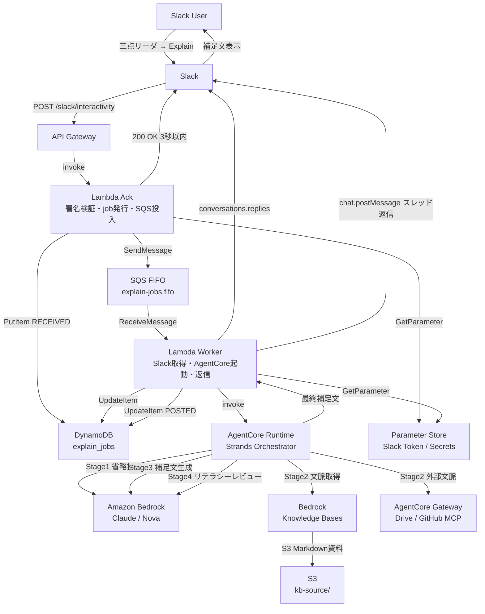
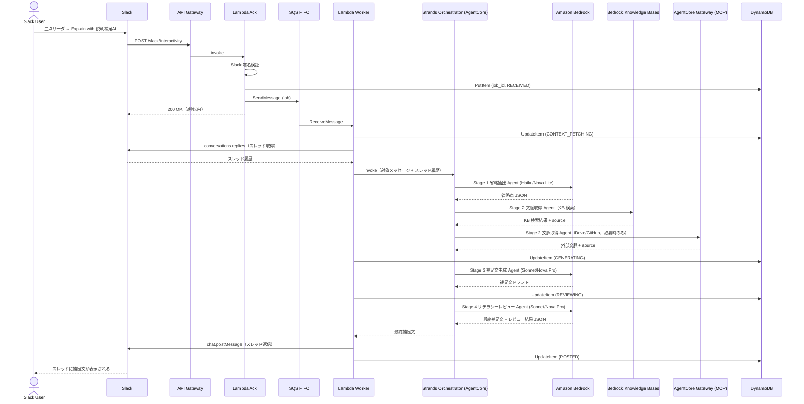
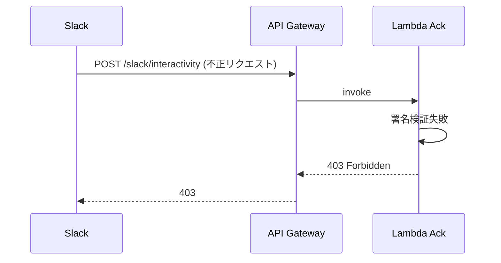
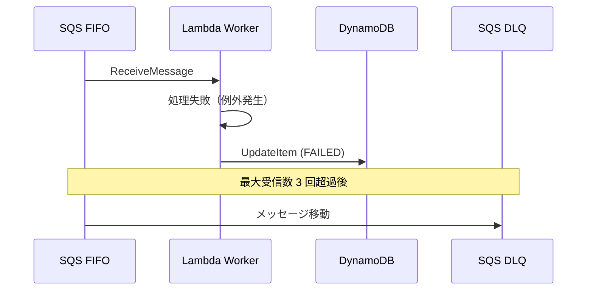

# Design Document: Context Butler（説明補足AI）

## Overview

Context Butler は、Slack 上の説明不足な投稿を受け手が三点リーダの Message Shortcut から呼び出し、AI が背景・前提・用語・判断理由・次アクションを補足して元投稿のスレッドへ返信するアプリケーションである。AWS Summit Japan 2026 AI-DLC ハッカソンのテーマ「人をダメにする」に対して、「説明責任・文脈整理・聞き手への配慮」を AI に外注し、人間が説明を考える努力を減らすという切り口で接続する。

MVP では Amazon Bedrock AgentCore Runtime + Strands Orchestrator を第一候補として採用し、省略抽出・文脈取得・補足文生成・リテラシーレビューの 4 Agent ステージを順次制御する。Slack の 3 秒制約は API Gateway + Lambda Ack + SQS FIFO による非同期化で回避し、補足文生成完了後に元投稿スレッドへ自動返信する。

主要定量指標は「想定補足ポイント充足率 80% 以上」であり、事前に用意したテストデータに対して補足文が期待する補足ポイントをどれだけ満たせたかで品質を評価する。

## Architecture



## Sequence Diagrams

### メインフロー: Shortcut 起動から補足文返信まで



### エラーフロー: 署名検証失敗



### エラーフロー: Worker 処理失敗



## Components and Interfaces

### Component 1: Lambda Ack（Unit A）

**Purpose**: Slack Interactivity Request を受信し、署名検証・job 発行・SQS 投入を行い、3 秒以内に 200 OK を返す。

**Interface**:

```python
# POST /slack/interactivity
def handler(event: APIGatewayProxyEvent, context: LambdaContext) -> APIGatewayProxyResponse:
    """
    Slack Interactivity Request を受信するエントリポイント。
    署名検証 → job 発行 → DynamoDB 保存 → SQS 投入 → 200 OK の順で処理する。
    AI 処理は一切行わない。
    """
    ...

def verify_slack_signature(
    signing_secret: str,
    timestamp: str,
    body: str,
    signature: str
) -> bool:
    """
    Slack 署名を検証する。
    タイムスタンプが現在時刻から 5 分以内であることも確認する。
    タイミング攻撃を防ぐため hmac.compare_digest を使用する。
    """
    ...

def create_job(
    channel_id: str,
    message_ts: str,
    user_id: str,
    trigger_id: str
) -> ExplainJob:
    """
    job_id (UUID v4) を発行し、DynamoDB に RECEIVED 状態で保存する。
    """
    ...
```

**Responsibilities**:
- Slack 署名検証（X-Slack-Signature / X-Slack-Request-Timestamp）
- リプレイ攻撃対策（タイムスタンプ 5 分以内チェック）
- job_id 発行（UUID v4）
- DynamoDB への job 保存（RECEIVED 状態）
- SQS FIFO へのメッセージ投入
- 3 秒以内の 200 OK 返却

**Configuration**:
- タイムアウト: 10 秒
- メモリ: 256 MB
- IAM: DynamoDB PutItem / SQS SendMessage / SSM GetParameter のみ

---

### Component 2: Lambda Worker（Unit A）

**Purpose**: SQS から job を受け取り、Slack API でメッセージ・スレッドを取得し、AgentCore を起動し、最終補足文をスレッドへ返信する。

**Interface**:

```python
def handler(event: SQSEvent, context: LambdaContext) -> None:
    """
    SQS FIFO からメッセージを受け取るエントリポイント。
    Slack API 取得 → AgentCore 起動 → スレッド返信 → job 状態更新の順で処理する。
    """
    ...

def fetch_slack_context(
    channel_id: str,
    message_ts: str,
    thread_ts: str | None
) -> SlackContext:
    """
    Slack Web API (conversations.replies) でスレッド履歴を取得する。
    Slack MCP は使わず、直接 API を呼び出す。
    """
    ...

def invoke_orchestrator(
    target_message: str,
    thread_history: list[SlackMessage],
    job_id: str
) -> str:
    """
    AgentCore Runtime 上の Strands Orchestrator を起動し、最終補足文を受け取る。
    AgentCore が利用できない場合は Bedrock 直接呼び出しへ退避する（同一入出力契約）。
    """
    ...

def post_supplement_to_thread(
    channel_id: str,
    thread_ts: str,
    supplement_text: str
) -> None:
    """
    Slack Web API (chat.postMessage) で補足文をスレッドへ返信する。
    """
    ...
```

**Responsibilities**:
- SQS メッセージの受信と job 状態管理
- Slack API によるメッセージ・スレッド取得
- AgentCore Runtime の起動（フォールバック: Bedrock 直接呼び出し）
- 補足文のスレッド返信
- エラーハンドリングと FAILED 状態への更新

**Configuration**:
- タイムアウト: 5 分
- メモリ: 512 MB
- IAM: DynamoDB GetItem/UpdateItem / SQS ReceiveMessage / Bedrock InvokeModel / S3 GetObject / SSM GetParameter のみ

---

### Component 3: Strands Orchestrator（Unit B）

**Purpose**: 4 つの Agent ステージ（省略抽出・文脈取得・補足文生成・リテラシーレビュー）を順次制御し、最終補足文を返す。

**Interface**:

```python
def run_pipeline(
    target_message: str,
    thread_history: list[SlackMessage],
    job_id: str,
    options: PipelineOptions | None = None
) -> PipelineResult:
    """
    4 Agent ステージを順次実行するメインパイプライン。
    各ステージの入出力を JSON Schema で検証する。
    """
    ...

class OmissionExtractorAgent:
    """
    Stage 1: 対象投稿から省略・暗黙知・聞き手が詰まりそうな点を抽出する。
    モデル: Claude 3.5 Haiku / Amazon Nova Lite (temperature: 0.2)
    """
    def run(self, input: OmissionExtractorInput) -> OmissionExtractorOutput: ...

class ContextRetrieverAgent:
    """
    Stage 2: retrieval_plan に基づき KB・Drive・GitHub から文脈を収集・整理する。
    モデル: Claude 3.5 Haiku / Amazon Nova Lite (temperature: 0.2)
    """
    def run(self, input: ContextRetrieverInput) -> ContextRetrieverOutput: ...

class SupplementComposerAgent:
    """
    Stage 3: 背景・前提・用語・判断理由・次アクションを整理した補足文を生成する。
    モデル: Claude 3.5 Sonnet / Amazon Nova Pro (temperature: 0.5)
    """
    def run(self, input: SupplementComposerInput) -> str: ...

class LiteracyReviewerAgent:
    """
    Stage 4: 事実/推測の分離・補足過多・個人情報・機密情報をチェックし最終文を出力する。
    モデル: Claude 3.5 Sonnet / Amazon Nova Pro (temperature: 0.2)
    """
    def run(self, input: LiteracyReviewerInput) -> LiteracyReviewerOutput: ...
```

**Responsibilities**:
- 4 Agent ステージの順次制御
- 各ステージ間のデータ受け渡し（JSON Schema 検証）
- エラーハンドリングと適切なエラーメッセージ返却

---

### Component 4: Bedrock Knowledge Bases（Unit C）

**Purpose**: デモ用社内ナレッジ（Markdown 資料）を RAG 検索し、文脈取得 Agent に根拠付きで情報を提供する。

**Interface**:

```python
def search_knowledge_base(
    query: str,
    kb_id: str,
    max_results: int = 5
) -> list[KBSearchResult]:
    """
    Bedrock Knowledge Bases を検索し、source 付きの結果を返す。
    文脈取得 Agent から呼び出される。
    """
    ...

class KBSearchResult:
    content: str
    source: str  # S3 URI または Markdown ファイル名
    score: float
```

**KB ソース構成**:
- `kb-source/project-overview.md` - プロジェクト概要・背景
- `kb-source/glossary.md` - 用語集（略語・専門用語の説明）
- `kb-source/system-architecture.md` - システム構成メモ
- `kb-source/decision-log.md` - 過去の意思決定メモ
- `kb-source/related-issues.md` - 関連 Issue / 議事録の要約

---

### Component 5: DynamoDB テーブル（Unit D）

**Purpose**: job 状態管理・ユーザー設定・チャンネル文脈管理。

**Interface**:

```python
class ExplainJob:
    job_id: str          # PK (UUID v4)
    channel_id: str      # GSI PK
    message_ts: str      # 対象メッセージのタイムスタンプ
    thread_ts: str       # スレッドのタイムスタンプ
    user_id: str         # 呼び出したユーザー
    status: JobStatus    # RECEIVED | CONTEXT_FETCHING | GENERATING | REVIEWING | POSTED | FAILED
    created_at: str      # ISO 8601
    updated_at: str      # ISO 8601
    ttl: int             # Unix timestamp (30日後)
    error_message: str | None  # サニタイズ済みのエラーメッセージ

class JobStatus(Enum):
    RECEIVED = "RECEIVED"
    CONTEXT_FETCHING = "CONTEXT_FETCHING"
    GENERATING = "GENERATING"
    REVIEWING = "REVIEWING"
    POSTED = "POSTED"
    FAILED = "FAILED"
```

**テーブル設計**:

| テーブル | PK | TTL | 用途 |
|---------|-----|-----|------|
| `explain_jobs` | job_id | 30 日 | job 状態管理（MVP Must） |
| `user_profiles` | user_id | なし | ユーザーリテラシー・役割管理（Should） |
| `channel_contexts` | channel_id | 90 日 | チャンネル文脈・用語集管理（Future） |

## Data Models

### OmissionExtractorOutput（Stage 1 出力）

```python
class OmissionExtractorOutput:
    message_intent: str          # 投稿の主旨（1文）
    omitted_points: list[str]    # 省略されている情報のリスト
    implicit_knowledge: list[ImplicitKnowledge]  # 暗黙知・略語・専門用語
    recommended_retrieval_plan: RetrievalPlan     # 必要な情報源の取得計画
    confidence: float            # 0.0〜1.0

class ImplicitKnowledge:
    term: str           # 用語・略語
    description: str    # 説明（推測の場合は明記）
    needs_retrieval: bool  # KB/外部から取得が必要か

class RetrievalPlan:
    use_knowledge_base: bool
    kb_queries: list[str]         # KB 検索クエリ
    use_drive_mcp: bool           # Google Drive MCP を使うか
    drive_queries: list[str]
    use_github_mcp: bool          # GitHub MCP を使うか
    github_queries: list[str]
```

**Validation Rules**:
- `message_intent` は空文字列不可
- `confidence` は 0.0〜1.0 の範囲
- `recommended_retrieval_plan` は必須

---

### ContextRetrieverOutput（Stage 2 出力）

```python
class ContextRetrieverOutput:
    retrieved_context: list[ContextItem]  # 取得できた文脈
    missing_context: list[str]            # 取得できなかった情報
    retrieval_sources_used: list[str]     # 実際に使用した情報源

class ContextItem:
    content: str    # 取得した内容
    source: str     # 情報源（slack_message / slack_thread / KB / Drive / GitHub）
    relevance: str  # 関連性の説明
```

**Validation Rules**:
- `retrieved_context` は空リスト可（取得できなかった場合）
- `missing_context` に取得できなかった情報を必ず記載する
- 各 `ContextItem` に `source` が必須

---

### LiteracyReviewerOutput（Stage 4 出力）

```python
class LiteracyReviewerOutput:
    approved: bool                    # 最終承認フラグ
    final_message: str                # 最終補足文（Slack マークダウン形式）
    review_comments: list[str]        # レビューコメント
    risk_level: RiskLevel             # LOW | MEDIUM | HIGH
    modifications_made: list[str]     # 自動修正した内容

class RiskLevel(Enum):
    LOW = "LOW"
    MEDIUM = "MEDIUM"
    HIGH = "HIGH"
```

**Validation Rules**:
- `approved: false` の場合、`final_message` はエラーメッセージを含む
- `final_message` は 200〜500 文字程度（目安）
- `risk_level: HIGH` の場合は `approved: false` を推奨

---

### SlackContext（Slack 取得データ）

```python
class SlackContext:
    target_message: SlackMessage      # 補足対象のメッセージ
    thread_history: list[SlackMessage]  # スレッド履歴

class SlackMessage:
    ts: str           # タイムスタンプ
    user: str         # ユーザー ID
    text: str         # メッセージ本文
    is_target: bool   # 補足対象メッセージか
```

**Validation Rules**:
- `target_message` は必須
- `text` は空文字列不可

## Algorithmic Pseudocode

### メインパイプライン制御アルゴリズム

```pascal
ALGORITHM run_pipeline(target_message, thread_history, job_id, options)
INPUT:
  target_message: SlackMessage  -- 補足対象メッセージ
  thread_history: list[SlackMessage]  -- スレッド履歴
  job_id: String  -- ジョブID
  options: PipelineOptions | null  -- 補足レベル・想定読者等
OUTPUT: PipelineResult

PRECONDITIONS:
  - target_message.text is non-empty
  - job_id is valid UUID v4
  - thread_history is a valid list (may be empty)

POSTCONDITIONS:
  - result.final_message is non-empty string
  - result.final_message length is 200-500 chars (guideline)
  - result.approved = true implies no critical safety violations

BEGIN
  // Stage 1: 省略抽出
  stage1_input ← OmissionExtractorInput(
    target_message = target_message,
    thread_history = thread_history
  )
  stage1_output ← omission_extractor_agent.run(stage1_input)
  ASSERT validate_schema(stage1_output, OMISSION_EXTRACTOR_SCHEMA)

  // Stage 2: 文脈取得
  stage2_input ← ContextRetrieverInput(
    omission_output = stage1_output,
    thread_history = thread_history
  )
  stage2_output ← context_retriever_agent.run(stage2_input)
  ASSERT validate_schema(stage2_output, CONTEXT_RETRIEVER_SCHEMA)

  // Stage 3: 補足文生成
  stage3_input ← SupplementComposerInput(
    target_message = target_message,
    omission_output = stage1_output,
    context_output = stage2_output,
    options = options
  )
  draft_message ← supplement_composer_agent.run(stage3_input)
  ASSERT draft_message is non-empty

  // Stage 4: リテラシーレビュー
  stage4_input ← LiteracyReviewerInput(
    draft_message = draft_message,
    omission_output = stage1_output,
    context_output = stage2_output
  )
  stage4_output ← literacy_reviewer_agent.run(stage4_input)
  ASSERT validate_schema(stage4_output, LITERACY_REVIEWER_SCHEMA)

  IF stage4_output.approved = false AND stage4_output.risk_level = HIGH THEN
    RETURN PipelineResult(
      success = false,
      error = "リテラシーレビューで重大な問題が検出されました",
      review_comments = stage4_output.review_comments
    )
  END IF

  RETURN PipelineResult(
    success = true,
    final_message = stage4_output.final_message,
    review_comments = stage4_output.review_comments
  )
END
```

**Preconditions**:
- `target_message.text` は空文字列でない
- `job_id` は有効な UUID v4
- `thread_history` は有効なリスト（空リスト可）

**Postconditions**:
- `result.final_message` は空文字列でない
- `result.final_message` の長さは 200〜500 文字程度（目安）
- `result.approved = true` の場合、重大な安全性違反がない

**Loop Invariants**: N/A（ループなし、順次処理）

---

### Slack 署名検証アルゴリズム

```pascal
ALGORITHM verify_slack_signature(signing_secret, timestamp, body, signature)
INPUT:
  signing_secret: String  -- AWS Parameter Store から取得
  timestamp: String       -- X-Slack-Request-Timestamp ヘッダー値
  body: String            -- リクエストボディ（raw bytes）
  signature: String       -- X-Slack-Signature ヘッダー値
OUTPUT: is_valid: Boolean

PRECONDITIONS:
  - signing_secret is non-empty
  - timestamp is non-empty string
  - body is non-empty string
  - signature starts with "v0="

POSTCONDITIONS:
  - Returns true if and only if signature is valid AND timestamp is within 5 minutes
  - No side effects

BEGIN
  // タイムスタンプ検証（リプレイ攻撃対策）
  current_time ← get_current_unix_timestamp()
  IF abs(current_time - to_integer(timestamp)) > 300 THEN
    RETURN false
  END IF

  // 署名ベース文字列の構築
  sig_basestring ← "v0:" + timestamp + ":" + body

  // HMAC-SHA256 で署名を計算
  computed_sig ← "v0=" + hmac_sha256(signing_secret, sig_basestring)

  // タイミング攻撃を防ぐ定数時間比較
  RETURN hmac_compare_digest(computed_sig, signature)
END
```

**Preconditions**:
- `signing_secret` は空文字列でない
- `timestamp` は Unix タイムスタンプ形式の文字列
- `signature` は "v0=" で始まる文字列

**Postconditions**:
- タイムスタンプが現在時刻から 5 分以内かつ署名が一致する場合のみ `true` を返す
- 入力パラメータへの副作用なし

**Loop Invariants**: N/A

---

### 文脈取得アルゴリズム（Context Retriever Agent）

```pascal
ALGORITHM retrieve_context(retrieval_plan, thread_history)
INPUT:
  retrieval_plan: RetrievalPlan  -- Stage 1 の推奨取得計画
  thread_history: list[SlackMessage]  -- Slack スレッド履歴
OUTPUT: ContextRetrieverOutput

PRECONDITIONS:
  - retrieval_plan is non-null
  - thread_history is a valid list

POSTCONDITIONS:
  - All retrieved items have non-empty source field
  - missing_context explicitly lists what could not be retrieved
  - No external sources are called beyond retrieval_plan scope

BEGIN
  retrieved_context ← []
  missing_context ← []
  sources_used ← []

  // Slack スレッド履歴は常に利用（Slack Web API で取得済み）
  FOR each message IN thread_history DO
    ASSERT message.text is non-empty
    context_item ← ContextItem(
      content = message.text,
      source = "slack_thread",
      relevance = "スレッド履歴"
    )
    retrieved_context.append(context_item)
  END FOR

  // Bedrock Knowledge Bases 検索
  IF retrieval_plan.use_knowledge_base = true THEN
    FOR each query IN retrieval_plan.kb_queries DO
      ASSERT query is non-empty
      results ← search_knowledge_base(query, KB_ID)
      IF results is non-empty THEN
        retrieved_context.extend(results)
        sources_used.append("knowledge_base")
      ELSE
        missing_context.append("KB: " + query + " に関する情報が見つかりませんでした")
      END IF
    END FOR
  END IF

  // Google Drive MCP（必要時のみ）
  IF retrieval_plan.use_drive_mcp = true THEN
    FOR each query IN retrieval_plan.drive_queries DO
      TRY
        results ← call_drive_mcp(query)
        retrieved_context.extend(results)
        sources_used.append("google_drive")
      CATCH MCPConnectionError
        missing_context.append("Drive: " + query + " の取得に失敗しました")
      END TRY
    END FOR
  END IF

  // GitHub MCP（必要時のみ）
  IF retrieval_plan.use_github_mcp = true THEN
    FOR each query IN retrieval_plan.github_queries DO
      TRY
        results ← call_github_mcp(query)
        retrieved_context.extend(results)
        sources_used.append("github")
      CATCH MCPConnectionError
        missing_context.append("GitHub: " + query + " の取得に失敗しました")
      END TRY
    END FOR
  END IF

  RETURN ContextRetrieverOutput(
    retrieved_context = retrieved_context,
    missing_context = missing_context,
    retrieval_sources_used = sources_used
  )
END
```

**Preconditions**:
- `retrieval_plan` は null でない
- `thread_history` は有効なリスト（空リスト可）

**Postconditions**:
- 全取得アイテムに `source` フィールドが設定されている
- 取得できなかった情報は `missing_context` に明示される
- `retrieval_plan` の範囲外の外部ソースは呼び出さない

**Loop Invariants**:
- KB クエリループ: 処理済みクエリは全て `retrieved_context` または `missing_context` に記録されている
- Drive/GitHub ループ: 同上

---

### job 状態管理アルゴリズム

```pascal
ALGORITHM process_job(sqs_message)
INPUT: sqs_message: SQSMessage
OUTPUT: void

PRECONDITIONS:
  - sqs_message.job_id is valid UUID v4
  - sqs_message.channel_id is non-empty
  - sqs_message.message_ts is non-empty

POSTCONDITIONS:
  - job status is POSTED or FAILED
  - If POSTED: supplement text has been posted to Slack thread
  - If FAILED: sanitized error_message is recorded in DynamoDB

BEGIN
  job_id ← sqs_message.job_id

  TRY
    // Slack 文脈取得
    update_job_status(job_id, CONTEXT_FETCHING)
    slack_context ← fetch_slack_context(
      sqs_message.channel_id,
      sqs_message.message_ts
    )

    // AgentCore / Orchestrator 起動
    update_job_status(job_id, GENERATING)
    pipeline_result ← invoke_orchestrator(
      slack_context.target_message,
      slack_context.thread_history,
      job_id
    )

    IF pipeline_result.success = false THEN
      update_job_status(job_id, FAILED, pipeline_result.error)
      RETURN
    END IF

    // Slack スレッドへ返信
    update_job_status(job_id, REVIEWING)
    post_supplement_to_thread(
      sqs_message.channel_id,
      slack_context.thread_ts,
      pipeline_result.final_message
    )

    update_job_status(job_id, POSTED)

  CATCH SlackAPIError AS e
    update_job_status(job_id, FAILED, "Slack API エラー: " + e.message)
    RAISE e  // SQS 再試行のため例外を再スロー

  CATCH BedrockError AS e
    update_job_status(job_id, FAILED, "Bedrock エラー: " + e.message)
    RAISE e

  CATCH Exception AS e
    update_job_status(job_id, FAILED, "予期しないエラー: " + e.message)
    RAISE e
  END TRY
END
```

**Preconditions**:
- `sqs_message.job_id` は有効な UUID v4
- `sqs_message.channel_id` は空文字列でない

**Postconditions**:
- job ステータスは POSTED または FAILED のいずれかになる
- POSTED の場合: 補足文が Slack スレッドに投稿されている
- FAILED の場合: サニタイズ済みの `error_message` が DynamoDB に記録されている

**Loop Invariants**: N/A（ループなし）

## Key Functions with Formal Specifications

### `verify_slack_signature()`

```python
def verify_slack_signature(
    signing_secret: str,
    timestamp: str,
    body: str,
    signature: str
) -> bool
```

**Preconditions**:
- `signing_secret` は空文字列でない（Parameter Store から取得済み）
- `timestamp` は Unix タイムスタンプ形式の文字列
- `body` は raw リクエストボディ（空文字列不可）
- `signature` は "v0=" で始まる文字列

**Postconditions**:
- タイムスタンプが現在時刻から 5 分以内かつ HMAC-SHA256 署名が一致する場合のみ `True` を返す
- 入力パラメータへの副作用なし
- タイミング攻撃を防ぐため `hmac.compare_digest` を使用する

**Loop Invariants**: N/A

---

### `run_pipeline()`

```python
def run_pipeline(
    target_message: SlackMessage,
    thread_history: list[SlackMessage],
    job_id: str,
    options: PipelineOptions | None = None
) -> PipelineResult
```

**Preconditions**:
- `target_message.text` は空文字列でない
- `job_id` は有効な UUID v4
- `thread_history` は有効なリスト（空リスト可）

**Postconditions**:
- `result.success = True` の場合、`result.final_message` は 200〜500 文字程度の補足文
- `result.success = True` の場合、重大な安全性違反（個人情報・根拠なし断定）がない
- `result.success = False` の場合、`result.error` にエラー理由が含まれる
- 4 Agent ステージが順次実行される（Stage 1 → 2 → 3 → 4）

**Loop Invariants**: N/A（順次処理）

---

### `search_knowledge_base()`

```python
def search_knowledge_base(
    query: str,
    kb_id: str,
    max_results: int = 5
) -> list[KBSearchResult]
```

**Preconditions**:
- `query` は空文字列でない
- `kb_id` は有効な Bedrock Knowledge Base ID
- `max_results` は 1 以上の整数

**Postconditions**:
- 返却リストの各要素に `source` フィールドが設定されている
- 返却リストの長さは `max_results` 以下
- 検索結果がない場合は空リストを返す（例外を投げない）

**Loop Invariants**: N/A

---

### `post_supplement_to_thread()`

```python
def post_supplement_to_thread(
    channel_id: str,
    thread_ts: str,
    supplement_text: str
) -> None
```

**Preconditions**:
- `channel_id` は空文字列でない
- `thread_ts` は有効な Slack タイムスタンプ
- `supplement_text` は空文字列でない

**Postconditions**:
- Slack スレッドに補足文が投稿される
- 投稿が成功した場合、例外を投げない
- 投稿が失敗した場合、`SlackAPIError` を投げる（SQS 再試行のため）

**Loop Invariants**: N/A

## Example Usage

### 基本的な補足呼び出しフロー

```python
# Lambda Ack: Slack Interactivity Request を受信
def handler(event, context):
    body = event["body"]
    timestamp = event["headers"]["X-Slack-Request-Timestamp"]
    signature = event["headers"]["X-Slack-Signature"]
    signing_secret = get_parameter("/context-butler/slack-signing-secret")

    # 署名検証
    if not verify_slack_signature(signing_secret, timestamp, body, signature):
        return {"statusCode": 403, "body": "Forbidden"}

    # payload 解析
    payload = parse_slack_payload(body)
    channel_id = payload["channel"]["id"]
    message_ts = payload["message"]["ts"]
    user_id = payload["user"]["id"]

    # job 発行
    job = create_job(channel_id, message_ts, user_id, payload["trigger_id"])

    # SQS 投入
    sqs.send_message(
        QueueUrl=SQS_QUEUE_URL,
        MessageBody=json.dumps(job.to_dict()),
        MessageGroupId=channel_id,
        MessageDeduplicationId=job.job_id
    )

    return {"statusCode": 200, "body": ""}
```

```python
# Lambda Worker: SQS から job を受け取り処理
def handler(event, context):
    for record in event["Records"]:
        job = ExplainJob.from_dict(json.loads(record["body"]))
        process_job(job)

def process_job(job: ExplainJob):
    update_job_status(job.job_id, JobStatus.CONTEXT_FETCHING)

    # Slack 文脈取得
    slack_context = fetch_slack_context(job.channel_id, job.message_ts)

    # AgentCore / Orchestrator 起動
    update_job_status(job.job_id, JobStatus.GENERATING)
    result = invoke_orchestrator(
        slack_context.target_message,
        slack_context.thread_history,
        job.job_id
    )

    if not result.success:
        update_job_status(job.job_id, JobStatus.FAILED, result.error)
        return

    # スレッド返信
    post_supplement_to_thread(
        job.channel_id,
        slack_context.thread_ts,
        result.final_message
    )
    update_job_status(job.job_id, JobStatus.POSTED)
```

```python
# Strands Orchestrator: 4 Agent ステージを順次実行
def run_pipeline(target_message, thread_history, job_id, options=None):
    # Stage 1: 省略抽出
    stage1 = OmissionExtractorAgent(model="anthropic.claude-3-5-haiku-20241022-v1:0")
    omission_output = stage1.run(OmissionExtractorInput(
        target_message=target_message,
        thread_history=thread_history
    ))

    # Stage 2: 文脈取得
    stage2 = ContextRetrieverAgent(model="anthropic.claude-3-5-haiku-20241022-v1:0")
    context_output = stage2.run(ContextRetrieverInput(
        omission_output=omission_output,
        thread_history=thread_history
    ))

    # Stage 3: 補足文生成
    stage3 = SupplementComposerAgent(model="anthropic.claude-3-5-sonnet-20241022-v2:0")
    draft = stage3.run(SupplementComposerInput(
        target_message=target_message,
        omission_output=omission_output,
        context_output=context_output,
        options=options
    ))

    # Stage 4: リテラシーレビュー
    stage4 = LiteracyReviewerAgent(model="anthropic.claude-3-5-sonnet-20241022-v2:0")
    review_output = stage4.run(LiteracyReviewerInput(
        draft_message=draft,
        omission_output=omission_output,
        context_output=context_output
    ))

    return PipelineResult(
        success=review_output.approved or review_output.risk_level != RiskLevel.HIGH,
        final_message=review_output.final_message,
        review_comments=review_output.review_comments
    )
```

### 補足文の出力例

```
補足です。この投稿は、社内ポータルの認証方式を既存の独自認証から
Cognito 連携に切り替える件についての共有です。

背景として、先週の定例でセキュリティ運用負荷を下げるため、認証基盤を
AWS 側に寄せる方針が合意されています。対象はまず開発環境で、本番切り替えは
別途判断予定です。

確認すべき人は、ログイン処理・ユーザー管理・権限チェックに関わる実装を
持つ担当者です。

次のアクションは、関連 Issue に影響範囲を追記し、来週の切り替え前に
懸念点をこのスレッドへ返信することです。

なお、本番適用日とロールバック手順はこの投稿だけでは明記されていません。
```

## Correctness Properties

以下の正当性プロパティは、テストデータに対する評価および単体テストで検証する。

### P1: 3 秒制約の遵守

```python
# Lambda Ack の処理時間は常に 3 秒未満
assert ack_response_time < 3.0  # seconds
# Lambda Ack は AI 処理を一切行わない
assert not ack_lambda_calls_bedrock()
assert not ack_lambda_calls_agentcore()
```

### P2: 署名検証の正確性

```python
# 有効な署名は常に True を返す
assert verify_slack_signature(valid_secret, valid_ts, valid_body, valid_sig) == True
# 無効な署名は常に False を返す
assert verify_slack_signature(valid_secret, valid_ts, valid_body, invalid_sig) == False
# 5 分以上古いタイムスタンプは False を返す
assert verify_slack_signature(valid_secret, old_ts, valid_body, valid_sig) == False
```

### P3: 重複排除の保証

```python
# 同一リクエストは 1 回のみ処理される（SQS FIFO コンテンツベース重複排除）
for _ in range(3):
    send_same_message_to_sqs(job)
assert count_processed_jobs(job.job_id) == 1
```

### P4: 補足文の安全性

```python
# 補足文に個人情報（メールアドレス）が含まれない
assert not contains_email_address(final_message)
# 補足文に個人情報（電話番号）が含まれない
assert not contains_phone_number(final_message)
# 補足文が「補足です。」で始まる
assert final_message.startswith("補足です。")
```

### P5: 想定補足ポイント充足率

```python
# テストデータに対して 80% 以上の充足率を達成する
for test_case in test_dataset:
    result = run_pipeline(test_case.message, test_case.thread_history, "test-job")
    score = evaluate_coverage(result.final_message, test_case.expected_points)
    assert score >= 0.8  # 80% 以上

# 全テストデータの平均充足率も 80% 以上
avg_score = mean([evaluate_coverage(r, t) for r, t in zip(results, test_dataset)])
assert avg_score >= 0.8
```

### P6: 事実/推測の分離

```python
# リテラシーレビュー Agent が根拠なし断定を検出・修正する
# 最終補足文に根拠なし断定が残っていないことを検証する
assert not contains_unsupported_assertion(review_output.final_message)
# ドラフトに根拠なし断定があった場合、modifications_made に修正記録が残っている
if contains_unsupported_assertion(draft_message):
    assert any("根拠なし断定" in m for m in review_output.modifications_made)
```

### P7: job 状態の一貫性

```python
# job は必ず POSTED または FAILED で終了する
for job in all_processed_jobs:
    assert job.status in [JobStatus.POSTED, JobStatus.FAILED]
# POSTED の場合、Slack スレッドに投稿が存在する
for job in posted_jobs:
    assert slack_thread_has_supplement(job.channel_id, job.message_ts)
```

### P8: ソース付き文脈取得

```python
# 全取得文脈アイテムに source が設定されている
for item in context_output.retrieved_context:
    assert item.source is not None and item.source != ""
# 取得できなかった情報は missing_context に明示される
assert len(context_output.missing_context) >= 0  # 空リスト可
```

## Error Handling

### Error Scenario 1: Slack 署名検証失敗

**Condition**: `X-Slack-Signature` が不正、またはタイムスタンプが 5 分以上古い  
**Response**: Lambda Ack が 403 Forbidden を返す。DynamoDB への job 保存・SQS 投入は行わない  
**Recovery**: Slack が再送しない（Slack 側でエラーとして扱われる）

---

### Error Scenario 2: SQS 処理失敗（Lambda Worker 例外）

**Condition**: Slack API エラー・Bedrock エラー・予期しない例外  
**Response**: Lambda Worker が例外を再スローし、SQS が可視性タイムアウト後に再試行する。DynamoDB の job を FAILED 状態に更新する  
**Recovery**: 最大 3 回再試行後、DLQ へ移動。CloudWatch アラームで通知

---

### Error Scenario 3: AgentCore Runtime 接続失敗

**Condition**: AgentCore Runtime が利用できない（設定エラー・タイムアウト）  
**Response**: 同一入出力契約を保った Bedrock 直接呼び出しへフォールバック  
**Recovery**: フォールバック後も同じ 4 Agent ステージを実行する。予選後に AgentCore へ戻す

---

### Error Scenario 4: リテラシーレビューで HIGH リスク検出

**Condition**: `risk_level = HIGH`（個人情報・機密情報の過剰出力・重大な根拠なし断定）  
**Response**: `approved = false` として補足文を Slack に投稿しない。DynamoDB の job を FAILED 状態に更新する  
**Recovery**: エラーメッセージをログに記録。Guardrails（Should）が有効な場合は Guardrails でも抑制

---

### Error Scenario 5: MCP 接続失敗（Drive / GitHub）

**Condition**: AgentCore Gateway 経由の MCP 接続がタイムアウト・認証エラー  
**Response**: `missing_context` に取得失敗を記録し、KB のみで補足文生成を継続する  
**Recovery**: MCP なしでも Bedrock Knowledge Bases を使った補足文生成でデモを成立させる

## Testing Strategy

### Unit Testing Approach

各コンポーネントを独立してテストする。

- **Lambda Ack**: 署名検証の正確性（有効・無効・タイムスタンプ期限切れ）、job 発行ロジック、SQS 投入のモック検証
- **Lambda Worker**: Slack API 取得のモック、AgentCore 起動のモック、job 状態遷移の検証
- **各 Agent**: プロンプトへの入力・出力 JSON Schema の検証、エッジケース（空メッセージ・長文・略語のみ）
- **Strands Orchestrator**: 4 ステージの順次実行、各ステージ間のデータ受け渡し

### Property-Based Testing Approach

**Property Test Library**: pytest + hypothesis（Python）

主要プロパティのテスト:

```python
from hypothesis import given, strategies as st

@given(st.text(min_size=1, max_size=500))
def test_supplement_starts_with_prefix(message_text):
    """任意の非空メッセージに対して補足文は「補足です。」で始まる"""
    result = run_pipeline_with_mock(message_text)
    assert result.final_message.startswith("補足です。")

@given(st.text(min_size=1), st.text(min_size=1), st.text(min_size=1))
def test_signature_verification_consistency(secret, body, timestamp):
    """同一入力に対して署名検証は常に同じ結果を返す（冪等性）"""
    sig = compute_valid_signature(secret, timestamp, body)
    result1 = verify_slack_signature(secret, timestamp, body, sig)
    result2 = verify_slack_signature(secret, timestamp, body, sig)
    assert result1 == result2

@given(st.lists(st.text(min_size=1), min_size=0, max_size=20))
def test_context_items_have_source(queries):
    """取得された全文脈アイテムに source が設定されている"""
    results = search_knowledge_base_mock(queries)
    for item in results:
        assert item.source is not None and item.source != ""
```

### Integration Testing Approach

- **E2E テスト**: Slack Shortcut 起動 → SQS → Worker → AgentCore → スレッド返信の全フロー
- **想定補足ポイント充足率評価**: 5〜10 パターンのテストデータに対して充足率を採点（目標: 80% 以上）
- **AgentCore フォールバックテスト**: AgentCore が利用できない場合に Bedrock 直接呼び出しへ正しくフォールバックするか

## Performance Considerations

- **Slack 3 秒制約**: Lambda Ack は署名検証と SQS 投入のみに特化し、AI 処理を一切行わない。目標処理時間: 1 秒以内
- **補足文生成 30 秒目標**: 省略抽出・文脈取得 Agent は Claude 3.5 Haiku / Amazon Nova Lite で高速化。補足文生成・リテラシーレビュー Agent は Claude 3.5 Sonnet / Amazon Nova Pro を使用
- **SQS 非同期化**: Slack の 3 秒制約を SQS FIFO による非同期化で回避。Worker Lambda のタイムアウトは 5 分
- **MCP 呼び出しの最小化**: `recommended_retrieval_plan` に基づき必要な場合のみ Drive / GitHub MCP を呼び出す
- **KB 検索の効率化**: デモ用 KB は小規模（数 MB）に保ち、検索レイテンシを最小化する

## Security Considerations

- **Slack 署名検証**: 全リクエストで `X-Slack-Signature` / `X-Slack-Request-Timestamp` を検証。`hmac.compare_digest` でタイミング攻撃を防ぐ
- **リプレイ攻撃対策**: タイムスタンプが現在時刻から 5 分以内であることを確認
- **最小権限**: Lambda Ack IAM は DynamoDB PutItem / SQS SendMessage / SSM GetParameter のみ。Lambda Worker IAM は必要最小限のポリシーのみ
- **シークレット管理**: Slack Token・Signing Secret・GitHub Token・Google OAuth Client Secret は AWS Parameter Store（SecureString）で管理。`.env` / `*.pem` / `credentials` は `.gitignore` に含める
- **MVP 権限境界**: デモは権限のある参加者のみを招待した Slack Private チャンネルで実施。パブリックチャンネル・DM は MVP 対象外
- **TTL 設定**: DynamoDB `explain_jobs` の TTL を 30 日に設定し、Slack 本文を長期保存しない
- **過剰露出抑制**: Drive / GitHub 取得情報は要約・抽象化して使用。リテラシーレビュー Agent が個人情報・機密情報の出力をチェック
- **Guardrails**: Bedrock Guardrails で個人情報・機密情報・根拠なし断定を抑制（MVP Should）
- **ログ管理**: CloudWatch Logs に job_id のみ記録。Slack 本文・個人情報・トークンはログに含めない。DynamoDB に保存する `error_message` もサニタイズ済みの内容に限定する

## Dependencies

| 依存関係 | バージョン | 用途 | MVP |
|---------|-----------|------|-----|
| `slack-sdk` | `>=3.27.0` | Slack Web API クライアント | Must |
| `strands-agents` | latest | Strands Orchestrator + Agent 実装 | Must |
| `boto3` | `>=1.34.0` | AWS SDK（DynamoDB / SQS / Bedrock / SSM） | Must |
| `aws-cdk-lib` | `>=2.150.0` | IaC（CDK Python） | Should |
| `pydantic` | `>=2.7.0` | JSON Schema 検証・データモデル | Must |
| `pytest` | `>=8.0.0` | 単体テスト | Must |
| `hypothesis` | `>=6.100.0` | プロパティベーステスト | Should |
| `python-dotenv` | `>=1.0.0` | ローカル開発用環境変数管理 | Must |

**AWS サービス依存関係**:

| サービス | 用途 | MVP |
|---------|------|-----|
| Amazon API Gateway | Slack Interactivity 受信 | Must |
| AWS Lambda | Ack・Worker | Must |
| Amazon SQS FIFO | 非同期化・重複排除 | Must |
| Amazon DynamoDB | job・ユーザー・チャンネル管理 | Must |
| Amazon S3 | KB ソース・ログ | Must |
| Amazon Bedrock (Claude / Nova) | LLM 推論 | Must |
| Amazon Bedrock Knowledge Bases | 社内ナレッジ RAG | Must |
| Amazon Bedrock AgentCore Runtime | Agent ホスティング | MVP Target（第一候補） |
| Amazon Bedrock Guardrails | 出力フィルタリング | Should |
| Amazon CloudWatch | ログ・監視 | Must |
| AWS IAM | 権限管理 | Must |
| AWS Systems Manager Parameter Store | シークレット管理 | Must |
| AWS CDK | IaC | Should |
