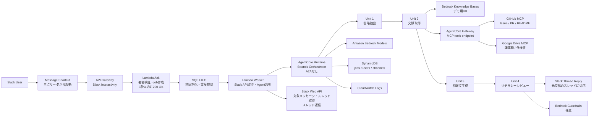

# 説明補足AI（Explain Bot）

> **「人類はついに、説明責任すらAIに外注できるようになりました」**

Slack上の説明不足な投稿を、受け手が追加質問せずに理解できる補足説明へ自動変換する AI アシスタントです。

---

## ハッカソンテーマとの関係

**AWS Summit Japan 2026 AI-DLC ハッカソン 参加作品**

ハッカソンテーマ：**「人をダメにする」**

通常、人は他者に伝わるように説明するために多くの努力をします。

- 背景を整理する
- 前提条件を書く
- 関連資料を探す
- 専門用語を噛み砕く
- 聞き手の知識レベルを考慮する
- 誤解が起きないように書く
- 必要な行動を明示する

本アプリは、これらの「説明責任」「文脈整理」「聞き手への配慮」を **AIに外注** します。

発言者は雑に投稿しても、AIが背景や前提を補ってくれます。聞き手も、追加質問や文脈を探す努力を減らせます。**人間の「説明する力」を弱らせ、人をダメにする** — しかし業務効率化としては普通に便利で、実用性もある。そのギリギリのラインを攻めたプロダクトです。

---

## 解決する課題

業務チャットでは、発言者が背景・前提・判断理由を省いたまま投稿し、聞き手が確認質問や認識合わせに時間を使うことが多くあります。

```
「例の認証の件、来週から切り替える方向で。影響あるところだけ確認お願いします。」
```

この投稿には以下が不足しています：

- 「例の認証」とは何か
- どのシステムの話か
- なぜ切り替えるのか
- いつ決まったのか
- 誰が何を確認すべきか
- 影響範囲は何か
- 関連する Issue / 資料はどこか

受け手は「これは何の話？」「背景は？」「何をすればいい？」と追加質問するか、自分で文脈を探すしかありません。

---

## デモ概要

1. Slack で分かりにくい投稿を見る
2. 投稿の **三点リーダ（…）** から「Explain with 説明補足AI」を選択
3. 数秒後、元投稿のスレッドに補足説明が自動投稿される

```
補足です。この投稿は、社内ポータルの認証方式を既存の独自認証から
Cognito 連携に切り替える件についての共有です。

背景として、先週の定例でセキュリティ運用負荷を下げるため、認証基盤を
AWS 側に寄せる方針が合意されています。対象はまず開発環境で、本番切り替えは
別途判断予定です。

確認すべき人は、ログイン処理・ユーザー管理・権限チェックに関わる実装を
持つ担当者です。

次のアクションは、関連 Issue に影響範囲を追記し、来週の切り替え前に
懸念点をこのスレッドへ返信することです。

なお、本番適用日とロールバック手順はこの投稿だけでは明記されていません。
```

---

## 主要機能

| 機能 | 説明 |
|------|------|
| Message Shortcut 起動 | Slack の三点リーダから自然に呼び出せる |
| 省略抽出 | 何が省略されているかを構造化して抽出 |
| 文脈取得 | スレッド・チャンネル履歴・KB・Drive・GitHub から必要な情報を収集 |
| 補足文生成 | 背景・前提・用語・判断理由・次アクションを整理した返信文を生成 |
| リテラシーレビュー | 事実と推測の分離、補足過多チェック、Slack 投稿品質の確認 |
| スレッド返信 | 元投稿のスレッドに補足文を自動投稿 |

---

## Unit 分解

本アプリは、以下 4 つの専門 Agent で構成されます。

```
┌─────────────────────────────────────────────────────────────┐
│                    Strands Orchestrator                      │
│                                                             │
│  Unit 1          Unit 2          Unit 3          Unit 4     │
│  省略抽出        文脈取得        補足文生成      リテラシー  │
│  Agent    ──▶   Agent    ──▶   Agent    ──▶   レビュー     │
│                                                Agent        │
│  何が足りないか  必要な情報を    伝わる補足文を  品質・安全  │
│  を抽出する      収集・整理する  生成する        を確認する  │
└─────────────────────────────────────────────────────────────┘
```

| Unit | Agent | 責務 |
|------|-------|------|
| 1 | 省略抽出 Agent | 対象投稿から省略・暗黙知・聞き手が詰まる点を抽出 |
| 2 | 文脈取得 Agent | スレッド・KB・Drive・GitHub から必要文脈を収集 |
| 3 | 補足文生成 Agent | 背景・前提・用語・判断理由・次アクションを整理した返信文を生成 |
| 4 | リテラシーレビュー Agent | 事実/推測の分離・補足過多・品質・安全性を確認し最終文を出力 |

---

## アーキテクチャ



詳細は [docs/03_architecture.md](docs/03_architecture.md) を参照してください。

---

## 技術スタック

| カテゴリ | 技術 |
|----------|------|
| チャット連携 | Slack (Message Shortcut / Web API) |
| API | Amazon API Gateway |
| 非同期処理 | Amazon SQS FIFO |
| コンピュート | AWS Lambda (Python) |
| AI エージェント | Amazon Bedrock AgentCore Runtime + Strands Agents |
| LLM | Amazon Bedrock (Claude 3.5 Haiku / Claude 3.5 Sonnet / Amazon Nova) |
| RAG | Amazon Bedrock Knowledge Bases |
| 外部連携 | AgentCore Gateway + MCP (Google Drive / GitHub) |
| データベース | Amazon DynamoDB |
| ストレージ | Amazon S3 |
| 安全性 | Amazon Bedrock Guardrails |
| 監視 | Amazon CloudWatch |
| IaC | AWS CDK (Python) |

---

## セットアップ

### 前提条件

- AWS アカウント（Bedrock モデルアクセス有効化済み）
- Slack Workspace（App 作成権限あり）
- Python 3.12+
- AWS CDK v2
- Node.js 18+（CDK 用）

### 1. リポジトリのクローン

```bash
git clone https://github.com/taku-arsenal/context-butler.git
cd context-butler
```

### 2. Python 依存関係のインストール

```bash
pip install -r requirements.txt
```

### 3. Slack App の作成

[docs/07_slack_app_design.md](docs/07_slack_app_design.md) の手順に従って Slack App を作成し、以下を設定してください。

- Message Shortcut の作成
- Interactivity URL の設定
- Bot Token Scopes の設定

### 4. 環境変数の設定

```bash
cp .env.example .env
```

`.env.example` をもとに、以下の環境変数を設定します。

```env
SLACK_BOT_TOKEN=xoxb-...
SLACK_SIGNING_SECRET=...
AWS_REGION=ap-northeast-1
DYNAMODB_JOBS_TABLE=explain_jobs
DYNAMODB_USERS_TABLE=user_profiles
DYNAMODB_CHANNELS_TABLE=channel_contexts
SQS_QUEUE_URL=https://sqs.ap-northeast-1.amazonaws.com/...
BEDROCK_KB_ID=...
```

### 5. AWS リソースのデプロイ

> **Note**: IaC（AWS CDK）は予選フェーズで整備予定です。現時点では AWS コンソールまたは AWS CLI で手動デプロイしてください。手順は [docs/03_architecture.md](docs/03_architecture.md) を参照してください。

### 6. Slack App の Interactivity URL を更新

API Gateway デプロイ後に出力される URL を Slack App の Interactivity URL に設定してください。

---

## デモ手順

詳細は [docs/10_demo_scenario.md](docs/10_demo_scenario.md) を参照してください。

1. 権限のある参加者のみを招待したデモ用 Slack Private チャンネルに以下の投稿を用意する：
   ```
   例の認証の件、来週から切り替える方向で。影響あるところだけ確認お願いします。
   ```
2. 投稿の三点リーダから「Explain with 説明補足AI」を選択
3. スレッドに補足文が返信されることを確認

MVP の評価では、デモ参加者の定性評価に加えて、事前に定義した想定補足ポイントを生成結果がどれだけ満たしたかを確認します。

---

## ディレクトリ構成

```
.
├── README.md
├── docs/
│   ├── 01_inception.md          # AI-DLC Inception（書類審査の核心）
│   ├── 02_requirements.md       # 要件定義
│   ├── 03_architecture.md       # AWS アーキテクチャ・構成図
│   ├── 04_unit_breakdown.md     # 4 Unit / 4 Agent 詳細設計
│   ├── 05_mvp_scope.md          # MVP スコープ
│   ├── 06_ai_agent_design.md    # Agent プロンプト設計
│   ├── 07_slack_app_design.md   # Slack App 設定手順
│   ├── 08_data_design.md        # DynamoDB テーブル設計
│   ├── 09_security_privacy.md   # セキュリティ・プライバシー
│   ├── 10_demo_scenario.md      # デモシナリオ
│   ├── 11_presentation_outline.md # プレゼン構成案
│   └── 12_future_roadmap.md     # 将来展望
├── src/
│   ├── lambdas/
│   │   ├── slack_ack/           # Slack Ack Lambda（3秒以内応答）
│   │   └── worker/              # Worker Lambda（Agent 起動）
│   ├── agents/
│   │   ├── orchestrator/        # Strands Orchestrator
│   │   ├── omission_extractor/  # Unit 1: 省略抽出 Agent
│   │   ├── context_retriever/   # Unit 2: 文脈取得 Agent
│   │   ├── supplement_composer/ # Unit 3: 補足文生成 Agent
│   │   └── literacy_reviewer/   # Unit 4: リテラシーレビュー Agent
│   └── integrations/
│       └── slack/               # Slack API クライアント
├── prompts/
│   ├── omission_extractor.md    # Unit 1 プロンプト
│   ├── context_retriever.md     # Unit 2 プロンプト
│   ├── supplement_composer.md   # Unit 3 プロンプト
│   └── literacy_reviewer.md     # Unit 4 プロンプト
└── demo/
    ├── slack_messages.md        # デモ用 Slack 投稿例
    ├── kb_docs/                 # デモ用ナレッジベース資料
    ├── github_issues.md         # デモ用 GitHub Issue 例
    └── drive_docs/              # デモ用 Drive 資料

# 予選フェーズで追加予定
# ├── infra/cdk/                 # AWS CDK (Python)
# └── tests/                     # テストコード
```

---

## 今後の展望

- **近い将来**: チャンネル用語集自動生成、ユーザー別リテラシー学習、フィードバックによる品質改善
- **中長期**: Web 会議リアルタイム補足、ドキュメント作成支援、A2A 対応による Agent 共通化
- **エンタープライズ**: SSO 連携、監査ログ、権限連動検索

詳細は [docs/12_future_roadmap.md](docs/12_future_roadmap.md) を参照してください。

---

## 参考資料

- [AI-DLC Inception ドキュメント](docs/01_inception.md)
- [AWS アーキテクチャ](docs/03_architecture.md)
- [4 Unit / 4 Agent 設計](docs/04_unit_breakdown.md)
- [MVP スコープ](docs/05_mvp_scope.md)
- [デモシナリオ](docs/10_demo_scenario.md)
- [Amazon Bedrock AgentCore](https://aws.amazon.com/bedrock/agentcore/)
- [Strands Agents](https://strandsagents.com/)
- [Slack API - Message Shortcuts](https://api.slack.com/interactivity/shortcuts/using)

---

## チーム

AWS Summit Japan 2026 AI-DLC ハッカソン 参加チーム

**開発実績**: Amazon Bedrock を用いた適合性判定 AI、個人情報検知 AI、Amazon Connect チャットボット、生成 AI コンテスト 2025 参加（採用担当向け育成 AI コーチ）など。
