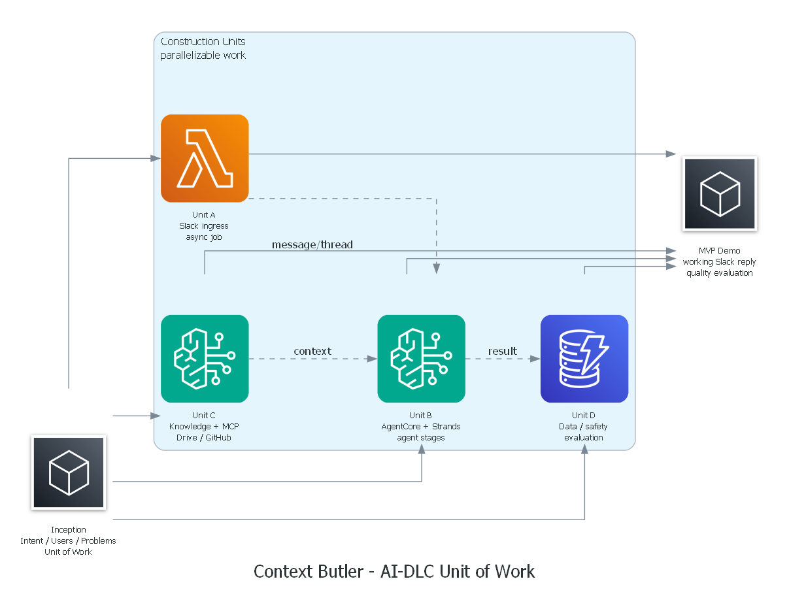

# 04 Unit of Work Plan

**プロジェクト名**: Context Butler / 説明補足AI（Explain Bot）

---

## AI-DLC Unit of Work とは

AI-DLC における Unit of Work は、**Intent から導かれる、凝集度が高く自己完結した作業単位**です。DDD のサブドメインや Scrum の Epic に近く、複数の user story / task / risk / NFR / measurement criteria を束ね、並行開発しやすい単位として扱います。

> **重要**: 実行時の Agent ステージ（省略抽出 / 文脈取得 / 補足文生成 / リテラシーレビュー）は、Unit B に含まれる **実行時コンポーネント** です。これらを AI-DLC の Unit of Work と呼ぶことはしません。

---

## Unit of Work 全体像

```
Intent: Slack の説明不足な投稿を AI が補足してスレッドへ返信する
  │
  ├── Unit A: Slack 起動・非同期ジョブ基盤
  │     Slack Message Shortcut → 3 秒 ack → SQS → Worker → スレッド返信
  │
  ├── Unit B: AgentCore + Strands 補足生成パイプライン
  │     省略抽出 → 文脈取得 → 補足文生成 → リテラシーレビュー（4 Agent ステージ）
  │
  ├── Unit C: ナレッジ・MCP 連携
  │     Bedrock Knowledge Bases（MVP Must）+ AgentCore Gateway（Drive / GitHub MCP はMVP Target / Future）
  │
  └── Unit D: データ永続化・安全性・評価
        DynamoDB job 管理 + Guardrails + 想定補足ポイント充足率評価
```



---

## Unit A: Slack 起動・非同期ジョブ基盤

### 目的

Slack Message Shortcut から job を安全に受け付け、3 秒以内に ack し、非同期処理へ渡す。補足文が生成されたら元投稿のスレッドへ返信する。

### 含まれる User Stories

- US-01: 三点リーダから補足を呼び出せる（起動・ack・返信）
- US-04 / US-06: Slack モーダルで補足レベル・想定読者を選択できる（Should）

### 主な成果物

| 成果物 | 説明 |
|--------|------|
| Slack App 設定 | Message Shortcut 定義・Interactivity URL 設定 |
| Amazon API Gateway | POST /slack/interactivity エンドポイント |
| Lambda Ack | Slack 署名検証・job_id 発行・DynamoDB 保存・SQS 投入・3 秒以内 200 OK |
| Amazon SQS FIFO | 非同期化・重複排除・DLQ |
| Lambda Worker | Slack API でメッセージ・スレッド取得・AgentCore 起動・スレッド返信 |

### 依存関係

- Unit B の最終補足文出力を受け取ってスレッドへ返信する
- Unit D の `explain_jobs` テーブルへ job 状態を保存する

### 並行開発できる理由

Slack / API Gateway / Lambda / SQS の境界が明確で、AI 処理（Unit B）と独立して開発できます。Unit B の出力をモックに差し替えれば、Slack 起動・ack・返信の動作を Unit B の完成を待たずに検証できます。

### 受け入れ条件

- [ ] Message Shortcut から対象メッセージを特定できる
- [ ] Slack の 3 秒制約内に 200 OK を返せる
- [ ] 同一リクエストの重複実行を SQS FIFO で抑制できる
- [ ] Worker が対象メッセージとスレッド履歴を Slack API で取得できる
- [ ] Worker が最終補足文を元投稿スレッドへ投稿できる
- [ ] Slack 署名検証が実装されている

### リスク

| リスク | 対策 |
|--------|------|
| Slack API のレート制限 | 必要最小限の API 呼び出しに絞る |
| 3 秒制約を超える | Lambda Ack は署名検証と SQS 投入のみに特化し、AI 処理を一切行わない |
| Slack App 設定の複雑さ | Slack App 設定手順を docs に記録する |

### 測定基準

- Slack Interactivity への応答時間: 3 秒以内
- Lambda Ack の処理時間: 1 秒以内
- SQS 重複排除の動作確認

---

## Unit B: AgentCore + Strands 補足生成パイプライン

### 目的

対象メッセージと収集した文脈から補足文を生成し、リテラシーレビューを経て最終文を返す。MVPでは AgentCore Runtime 上の Strands Orchestrator 利用を第一候補とし、4 つの Agent ステージを順次制御する。

### 含まれる User Stories

- US-02: 関連情報が補足文に反映される
- US-03: 略語・専門用語の説明が含まれる
- US-05: 技術的な投稿の意味を理解できる
- US-07: 雑な投稿でも補足文が生成される
- US-08: 事実と推測が分けて書かれる
- US-09: 次に取るべき行動が明確に書かれる
- US-10: 補足文が適切な長さに収まる

### 実行時 Agent ステージ（Unit B 内部の処理単位）

Unit B の中で、以下の 4 つの Agent ステージが Strands Orchestrator によって順次制御されます。これらは AI-DLC の Unit of Work ではなく、Unit B に含まれる実行時コンポーネントです。

```
入力: 対象メッセージ + スレッド履歴 + 取得済み文脈
  │
  ▼
Stage 1: 省略抽出 Agent
  役割: 対象投稿から省略・暗黙知・聞き手が詰まりそうな点を抽出する
  出力: 構造化 JSON（omitted_points / implicit_knowledge / recommended_retrieval_plan）
  │
  ▼
Stage 2: 文脈取得 Agent
  役割: retrieval_plan に基づき KB・Drive・GitHub から必要文脈を収集・整理する
  出力: 構造化 JSON（retrieved_context / missing_context）
  │
  ▼
Stage 3: 補足文生成 Agent
  役割: 背景・前提・用語・判断理由・次アクションを整理した補足文を生成する
  出力: 補足文ドラフト（Slack マークダウン形式）
  │
  ▼
Stage 4: リテラシーレビュー Agent
  役割: 事実/推測の分離・補足過多チェック・個人情報確認・品質確認
  出力: 最終補足文 + レビュー結果 JSON
  │
  ▼
出力: 最終補足文（Slack スレッドへ返信）
```

### 主な成果物

| 成果物 | 説明 |
|--------|------|
| AgentCore Runtime 設定 | Strands Orchestrator のホスティング設定 |
| Strands Orchestrator | 4 Agent ステージの順次制御ロジック |
| 省略抽出 Agent | 構造化 JSON 出力プロンプト + 実装 |
| 文脈取得 Agent | retrieval_plan に基づく文脈収集プロンプト + 実装 |
| 補足文生成 Agent | 補足文生成プロンプト + 実装 |
| リテラシーレビュー Agent | レビュー・修正プロンプト + 実装 |
| Agent 間データフロー定義 | 各ステージの入出力 JSON スキーマ |

### 依存関係

- Unit A から対象メッセージとスレッド履歴を受け取る
- Unit C から取得文脈（KB / Drive / GitHub）を受け取る
- Unit D の評価観点で出力品質を検証する

### 並行開発できる理由

入出力契約（JSON スキーマ）を固定すれば、Slack 基盤（Unit A）や MCP 連携（Unit C）と独立してプロンプト・Orchestrator を開発できます。Unit A / C をモックに差し替えれば、補足生成パイプラインを単体で検証できます。

### 受け入れ条件

- [ ] 省略点・必要文脈・補足文・レビュー結果を構造化 JSON で受け渡せる
- [ ] 事実と推測を分離できる
- [ ] 不明点を「この投稿だけでは明記されていません」と表現できる
- [ ] Slack に投稿して自然な長さ・文体に整えられる（200〜500 文字目安）
- [ ] AgentCore Runtime を第一候補として利用できる
- [ ] AgentCore Runtime 設定で詰まった場合も、同じ入出力契約で Bedrock 直接呼び出しへ退避できる

### リスク

| リスク | 対策 |
|--------|------|
| AgentCore Runtime 設定の遅延 | MVP から第一候補として利用。詰まった場合のみ同じ入出力契約で Bedrock 直接呼び出しへ退避 |
| 事実誤認・根拠なし断定 | リテラシーレビュー Agent で事実/推測を分離。不明点は「不明」と明記 |
| 補足文が長すぎる | リテラシーレビュー Agent でトークン数・文字数チェック |
| 生成遅延（30 秒超） | 軽い Agent（省略抽出・文脈取得）は Haiku / Nova Lite で高速化 |

### 測定基準

- 補足文生成完了時間: 30 秒以内（目標）
- 想定補足ポイント充足率: 80% 以上
- 事実/推測の分離: 重大な根拠なし断定がない

---

## Unit C: ナレッジ・MCP 連携

### 目的

MVP Must として Bedrock Knowledge Bases から補足に必要な根拠を取得する。Google Drive / GitHub MCP はMVPで実装を目指し、間に合わない場合はFutureとして扱う。Slack 文脈取得は Slack Web API を直接使い、MCP は外部データソース（Drive / GitHub）のみに限定する。

### 含まれる User Stories

- US-02: 関連情報が補足文に反映される（KB 連携）
- US-02: 関連 Issue や議事録への言及が含まれる（Drive / GitHub MCP。MVP Target / Future）

### 主な成果物

| 成果物 | 説明 |
|--------|------|
| Bedrock Knowledge Bases | デモ用 Markdown 資料を S3 に配置し KB 化 |
| S3 KB ソース | プロジェクト概要・用語集・過去の意思決定メモ等 |
| AgentCore Gateway 設定 | MCP tools endpoint の設定 |
| Google Drive MCP 接続 | 議事録・仕様書・設計メモの取得（MVP Target / Future） |
| GitHub MCP 接続 | Issue・PR・README・ADR の取得（MVP Target / Future） |

### 依存関係

- Unit B の文脈取得 Agent から呼び出される（retrieval_plan に基づく）
- Unit D の権限制御・安全性方針に従う

### 並行開発できる理由

外部データ取得はインターフェース化でき、モックから本接続へ段階的に差し替えられます。KB は S3 に Markdown を配置するだけで最小実装でき、Drive / GitHub MCP はMVPで実装を目指しつつ、難しい場合はFutureへ回せます。

### 受け入れ条件

- [ ] 文脈取得 Agent から検索要求を受け、必要な情報源のみ参照できる
- [ ] KB の取得結果を source 付きで返せる
- [ ] Drive / GitHub MCP は、実装できた場合に source 付きで取得結果を返せる
- [ ] 取得できた情報と取得できなかった情報を分離できる
- [ ] Slack 文脈取得は Slack Web API を直接使い、Slack MCP は使わない
- [ ] Private チャンネルに参加している権限者向けのデモに限定し、権限のない情報を Slack に貼らない

### リスク

| リスク | 対策 |
|--------|------|
| MCP 接続の複雑化 | Drive / GitHub のみに限定。MVPで実装を目指し、難しい場合はFutureへ回す |
| KB の検索精度が低い | デモ用 Markdown 資料を充実させる |
| Drive / GitHub の OAuth 管理 | MVP ではデモ用資料に限定。本番化時に OAuth を実装 |

### 測定基準

- KB 検索が文脈取得 Agent から呼び出せる
- 取得結果に source が付いている
- Drive / GitHub MCP は、本接続またはFuture化の判断基準が明確になっている

---

## Unit D: データ永続化・安全性・評価

### 目的

job 履歴の管理、Slack Private チャンネルを前提にした権限制御、Guardrails とリテラシーレビュー Agent による安全性確認、テストデータに対する想定補足ポイント充足率の評価を整える。

### 含まれる User Stories

- US-08: 事実と推測が分けて書かれる（安全性・評価）
- US-10: 補足文が適切な長さに収まる（評価）

### 主な成果物

| 成果物 | 説明 |
|--------|------|
| DynamoDB `explain_jobs` | job 状態管理（RECEIVED → GENERATING → POSTED / FAILED）・TTL 設定 |
| DynamoDB `user_profiles` | ユーザーリテラシー・役割管理（Should） |
| DynamoDB `channel_contexts` | チャンネル文脈・用語集管理（Future） |
| Bedrock Guardrails 設定 | 個人情報・機密情報・根拠なし断定の抑制（Should） |
| テストデータ評価表 | 想定補足ポイントを事前定義したテストデータセット |
| 評価スクリプト | 生成結果の想定補足ポイント充足率を採点するスクリプト |

### 依存関係

- Unit A が job 状態を `explain_jobs` に保存する
- Unit B の出力品質を評価観点で検証する
- Unit C の権限制御方針に従う

### 並行開発できる理由

DynamoDB / S3 / Guardrails / 評価データは他 Unit の入出力を受けて検証できます。テストデータと評価スクリプトは Unit B の実装と並行して準備できます。

### 受け入れ条件

- [ ] job の状態遷移を追跡できる（RECEIVED → CONTEXT_FETCHING → GENERATING → REVIEWING → POSTED / FAILED）
- [ ] Slack 本文や取得文脈を長期保存しすぎない（TTL 設定）
- [ ] 機密情報・個人情報を過剰に出力しない
- [ ] 事前に用意したテストデータごとに、想定補足ポイントの充足率を集計できる
- [ ] 審査員やデモ参加者が「説明不足な投稿の意味を理解しやすくなった」と評価できる

### リスク

| リスク | 対策 |
|--------|------|
| 機密情報の過剰露出 | MVP は Slack Private チャンネル + 権限者のみ招待。Drive/GitHub 取得情報は要約のみ使用 |
| テストデータが不十分 | デモ前にテストデータを充実させる（5〜10 パターン） |
| Guardrails の設定が複雑 | MVP では Should として扱い、リテラシーレビュー Agent を主な安全策にする |

### 測定基準

- job 処理成功率: 95% 以上（目標）
- 想定補足ポイント充足率: 80% 以上
- TTL 設定が有効になっている

---

## Unit of Work 間の依存関係

```
Unit A ──────────────────────────────────────────────────────────────────────┐
  Slack 起動・ack・SQS・Worker                                                │
  ↓ 対象メッセージ + スレッド履歴                                              │
Unit B ←──────────────────────────────────────────────────────────────────── │
  AgentCore + Strands 補足生成パイプライン                                     │
  ↑ 取得文脈（KB / Drive / GitHub）                                           │
Unit C                                                                        │
  ナレッジ・MCP 連携                                                           │
  ↓ 評価観点・安全性方針                                                       │
Unit D ←──────────────────────────────────────────────────────────────────── ┘
  データ永続化・安全性・評価
```

| 依存 | 方向 | 内容 |
|------|------|------|
| A → B | A が B を呼び出す | 対象メッセージ・スレッド履歴を渡す |
| C → B | B が C を呼び出す | 文脈取得 Agent が KB / MCP を呼び出す |
| A → D | A が D に書き込む | job 状態を DynamoDB に保存する |
| B → D | B が D を参照する | 評価観点で出力品質を検証する |
| C → D | C が D に従う | 権限制御・安全性方針に従う |

---

## Agent ステージと Unit of Work の対応表

| Agent ステージ | 所属 Unit | 説明 |
|---------------|----------|------|
| 省略抽出 Agent | Unit B | 対象投稿から説明不足・暗黙知・必要文脈を抽出する |
| 文脈取得 Agent | Unit B（外部呼び出しは Unit C） | 取得方針は Unit B、実際の外部検索は Unit C の機能を利用する |
| 補足文生成 Agent | Unit B | 背景・前提・次アクションを整理した補足文を生成する |
| リテラシーレビュー Agent | Unit B（安全性観点は Unit D） | レビュー処理は Unit B、安全性・評価観点は Unit D と連携する |
