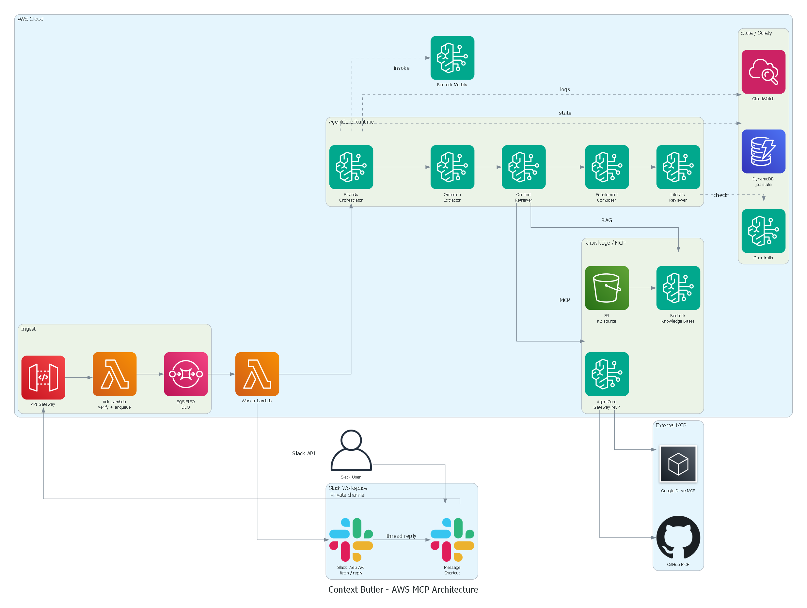
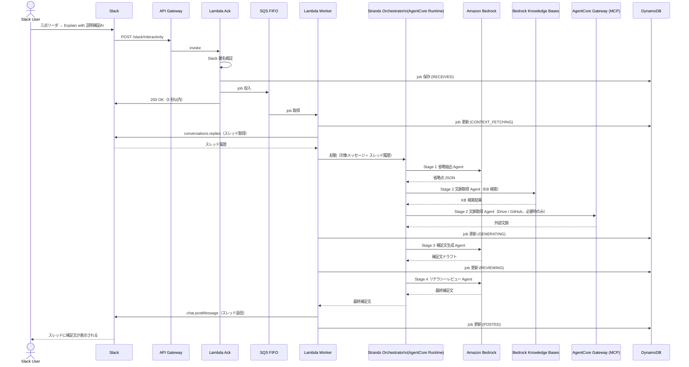

# 05 Application Design

**プロジェクト名**: Context Butler / 説明補足AI（Explain Bot）

---

## 1. AWS 構成概要

以下は `awslabs.aws-diagram-mcp-server` で生成した AWS + MCP 構成図です。



### 設計原則

1. **Slack の 3 秒制約に対応する**: API Gateway + Lambda Ack + SQS FIFO による非同期化
2. **AI 処理を単一 Orchestrator で制御する**: MVP から AgentCore Runtime + Strands Orchestrator の利用を第一候補にする
3. **外部データ取得を限定する**: MCP は Drive / GitHub のみ。Slack は直接 API
4. **MVP では複雑性を抑える**: A2A は使わない。4 つの Agent ステージを Orchestrator 内部で制御

---

## 2. Slack から返信までの流れ



---

## 3. コンポーネント詳細

### 3.1 Lambda Ack（Unit A）

- **役割**: Slack 署名検証・job_id 発行・DynamoDB 保存・SQS 投入・3 秒以内 200 OK
- **重要**: 生成 AI を呼ばない。署名検証と SQS 投入のみ
- **タイムアウト**: 10 秒 / **メモリ**: 256 MB

### 3.2 SQS FIFO（Unit A）

| 設定 | 値 |
|------|-----|
| キュータイプ | FIFO |
| 重複排除 | コンテンツベース |
| メッセージグループ | `{slack_channel_id}` |
| 可視性タイムアウト | 300 秒 |
| DLQ | 有効（最大受信数: 3） |

### 3.3 Lambda Worker（Unit A）

- **役割**: SQS から job を受け取り、Slack API でメッセージ・スレッド取得 → AgentCore 起動 → スレッド返信
- **タイムアウト**: 5 分 / **メモリ**: 512 MB

### 3.4 AgentCore Runtime + Strands Orchestrator（Unit B）

- **役割**: 4 つの Agent ステージを順次制御する
- **A2A**: MVP では使わない（将来拡張として設計）
- **MVP 方針**: AgentCore Runtime を予選 MVP から利用することを第一候補にする。設定で詰まった場合のみ、同じ Agent 入出力契約を保った Bedrock 直接呼び出しで継続し、予選後にAgentCoreへ戻す

```
Orchestrator の制御フロー:
  1. Stage 1（省略抽出 Agent）を実行 → 省略点 JSON
  2. Stage 2（文脈取得 Agent）を実行 → 取得文脈 JSON
  3. Stage 3（補足文生成 Agent）を実行 → 補足文ドラフト
  4. Stage 4（リテラシーレビュー Agent）を実行 → 最終補足文
```

### 3.5 Amazon Bedrock モデル選定（Unit B）

| Agent ステージ | モデル候補 | 理由 |
|--------------|-----------|------|
| 省略抽出 Agent | Claude 3.5 Haiku / Amazon Nova Lite | 構造化 JSON 出力・高速・低コスト |
| 文脈取得 Agent | Claude 3.5 Haiku / Amazon Nova Lite | 構造化 JSON 出力・高速・低コスト |
| 補足文生成 Agent | Claude 3.5 Sonnet / Amazon Nova Pro | 日本語品質・自然な文章生成 |
| リテラシーレビュー Agent | Claude 3.5 Sonnet / Amazon Nova Pro | 日本語品質・判断精度 |

### 3.6 Bedrock Knowledge Bases（Unit C）

- **用途**: 社内ナレッジの RAG 検索
- **MVP**: デモ用 Markdown 資料を S3 に配置し Knowledge Base 化
- **検索対象**: プロジェクト概要・用語集・システム構成メモ・過去の意思決定メモ

### 3.7 AgentCore Gateway（MCP tools endpoint）（Unit C）

- **用途**: 外部データソースへの接続
- **対象**: Google Drive・GitHub のみ
- **使わないもの**: Slack MCP は使わない。Slack の対象メッセージ・スレッド取得・返信は Slack Web API を直接利用する
- **呼び出し元**: 文脈取得 Agent が、省略抽出 Agent の `recommended_retrieval_plan` に基づいて必要な場合のみ呼び出す

### 3.8 DynamoDB（Unit D）

| テーブル | 用途 | TTL |
|---------|------|-----|
| `explain_jobs` | job 状態管理 | 30 日 |
| `user_profiles` | ユーザーリテラシー・役割管理 | なし |
| `channel_contexts` | チャンネル文脈・用語集管理 | 90 日 |
| `feedback` | フィードバック記録 | 180 日 |

### 3.9 Bedrock Guardrails（Unit D）

| フィルタ | 内容 |
|---------|------|
| 個人情報 | 氏名・メールアドレス・電話番号の過剰出力を防ぐ |
| 機密情報 | Drive / GitHub から取得した機密情報の過剰露出を防ぐ |
| 根拠なし断定 | 事実確認できない断定を防ぐ |

---

## 4. MCP 利用範囲

| データソース | 取得方法 | 理由 |
|------------|---------|------|
| Slack メッセージ・スレッド | Slack Web API を直接使用 | MCP の接続複雑性を避ける。Slack API で十分 |
| Slack スレッド返信 | Slack Web API を直接使用 | 同上 |
| 社内ナレッジ | Bedrock Knowledge Bases（RAG） | AWS ネイティブで統合しやすい |
| Google Drive（議事録・仕様書） | AgentCore Gateway 経由の Google Drive MCP | MVPで実装を目指し、難しい場合はFuture |
| GitHub（Issue・PR・README） | AgentCore Gateway 経由の GitHub MCP | MVPで実装を目指し、難しい場合はFuture |

---

## 5. データ保存

| データ | 保存先 | TTL | 備考 |
|--------|--------|-----|------|
| job 状態・対象メッセージ | DynamoDB `explain_jobs` | 30 日 | Slack 本文を長期保存しない |
| ユーザー設定 | DynamoDB `user_profiles` | なし | リテラシー・役割情報 |
| チャンネル文脈 | DynamoDB `channel_contexts` | 90 日 | 用語集・要約 |
| KB ソース | S3 `kb-source/` | なし | Markdown 資料 |
| チャンネル履歴要約 | S3 `channel-summaries/` | 90 日 | 定期更新 |
| 実行ログ | CloudWatch Logs | 30 日 | job_id のみ記録（本文は含めない） |

---

## 6. セキュリティ設計

### 6.1 Slack 署名検証

Lambda Ack で以下を検証します。

1. `X-Slack-Request-Timestamp` ヘッダーの存在確認
2. タイムスタンプが現在時刻から 5 分以内であることを確認（リプレイ攻撃対策）
3. `X-Slack-Signature` ヘッダーの存在確認
4. `hmac.compare_digest` でタイミング攻撃を防ぎながら署名を検証

### 6.2 MVP の権限境界

MVP デモでは、Explain Bot を権限のある参加者のみを招待した Slack Private チャンネルに追加します。

- デモ用 Private チャンネルに参加していないユーザーには補足結果を見せない
- 本番資料ではなく、デモ用に用意した KB / Drive / GitHub 相当データを利用する
- パブリックチャンネル・DM・全社横断検索は MVP 対象外

### 6.3 最小権限

| 対象 | 方針 |
|------|------|
| Slack Bot スコープ | `chat:write` / `groups:history` / `users:read` のみ |
| Lambda Ack IAM | DynamoDB PutItem / SQS SendMessage / SSM GetParameter のみ |
| Lambda Worker IAM | DynamoDB GetItem / UpdateItem / SQS ReceiveMessage / Bedrock InvokeModel / S3 GetObject のみ |

### 6.4 シークレット管理

- Slack Bot Token・Signing Secret・GitHub Token・Google OAuth Client Secret は AWS Parameter Store（SecureString）で管理
- `.env` / `.env.*` / `*.pem` / `credentials` は `.gitignore` に含める

### 6.5 過剰露出抑制

- Drive / GitHub から取得した情報をそのまま Slack に貼らない（要約・抽象化する）
- リテラシーレビュー Agent が個人情報・機密情報の過剰出力をチェックする
- Bedrock Guardrails で出力フィルタリングを追加する（Should）

---

## 7. AWS サービス一覧

| サービス | 用途 | MVP |
|---------|------|-----|
| API Gateway | Slack Interactivity 受信 | Must |
| Lambda | Ack・Worker | Must |
| SQS FIFO | 非同期化・重複排除 | Must |
| DynamoDB | job・ユーザー・チャンネル管理 | Must |
| S3 | KB ソース・ログ | Must |
| Bedrock (LLM) | AI 推論 | Must |
| Bedrock Knowledge Bases | 社内ナレッジ RAG | Must |
| Bedrock AgentCore Runtime | Agent ホスティング | MVP Target（第一候補） |
| Bedrock Guardrails | 出力フィルタリング | Should |
| CloudWatch | ログ・監視 | Must |
| IAM | 権限管理 | Must |
| CDK | IaC | Should |
