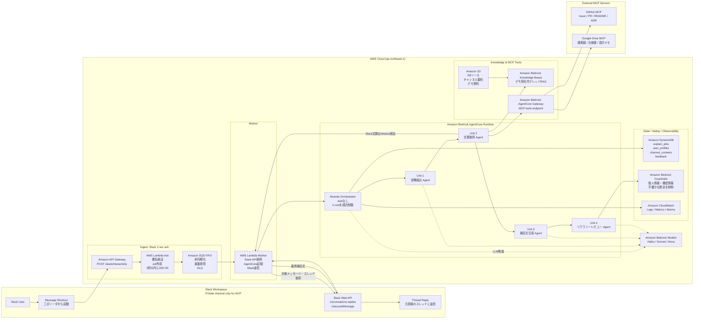
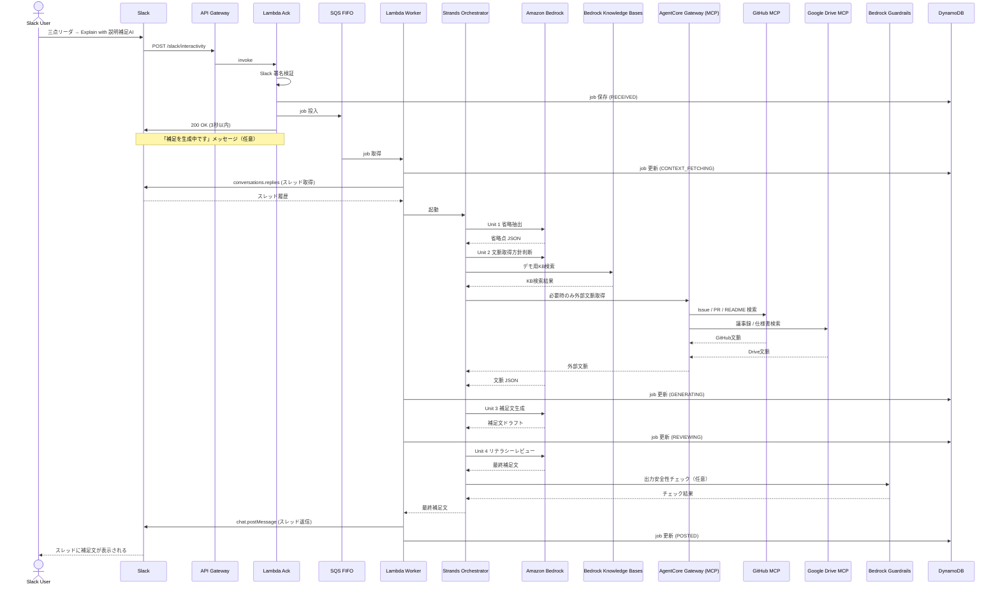
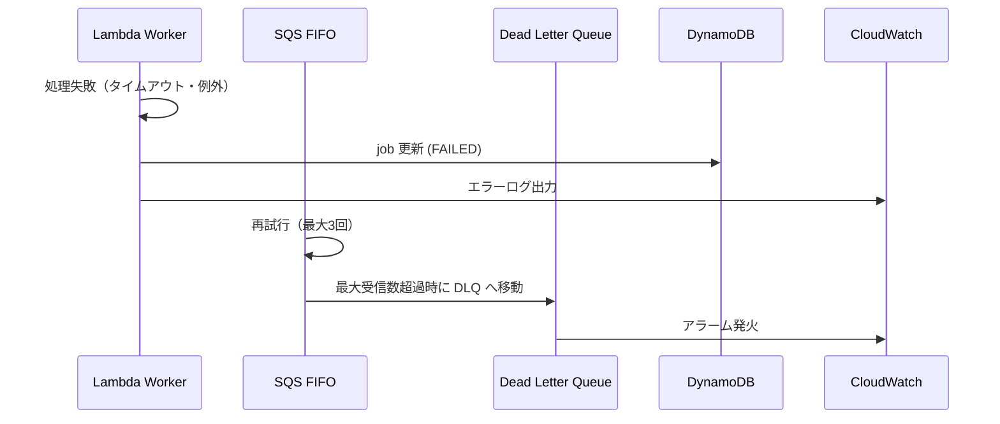

# AWS アーキテクチャ設計

**プロジェクト名**: 説明補足AI（Explain Bot）  
**バージョン**: 1.0.0  
**作成日**: 2026-05-10

---

## 1. アーキテクチャ概要

本アプリは、Slack の Message Shortcut を起点に、非同期処理で 4 Unit の AI Agent を実行し、元投稿のスレッドに補足文を返信する構成です。

### 設計原則

1. **Slack の 3 秒制約に対応する**: API Gateway + Lambda Ack + SQS FIFO による非同期化
2. **AI 処理を単一 Orchestrator で制御する**: MVP から AgentCore Runtime + Strands Orchestrator の利用を第一候補にする
3. **外部データ取得を限定する**: MCP は Drive / GitHub のみ。Slack は直接 API
4. **MVP では複雑性を抑える**: A2A は使わない。4 Agent を Orchestrator 内部で制御

---

## 2. 全体構成図



### 提供図からの修正点

以前の図案は、AgentCore Runtime を中心に MCP や Guardrails を配置できている点は有用です。一方で、現在の最終方針とは以下が異なるため、この設計書では上記の形に修正します。

| 提供図の要素 | 修正方針 | 理由 |
|-------------|----------|------|
| LINE Bot | 削除 | MVP は Slack のみに集中するため |
| Slack MCP | 削除 | Slack 文脈取得は Slack Web API を直接使うため |
| Speaker Literacy / Listener Literacy / Intent / Context などの 7 Agent 風分解 | 4 Unit / 4 Agent に統合 | AI-DLC の Unit 分解を「省略抽出、文脈取得、補足文生成、リテラシーレビュー」に絞るため |
| Fact MCP / Doc Search Agent | Unit 2 文脈取得 Agent と AgentCore Gateway に統合 | 外部I/Oは文脈取得Agentに集約し、MCPはDrive/GitHub接続のみに限定するため |
| Example Agent / streaming | 補足文生成 Agent に統合 | MVPではSlackスレッド返信を優先し、ストリーミング更新は将来拡張に回すため |
| Users + Channels Store | DynamoDB の `user_profiles` / `channel_contexts` として表現 | 既存のデータ設計と一致させるため |

---

## 3. コンポーネント詳細

### 3.1 Slack Workspace

| コンポーネント | 役割 |
|--------------|------|
| Message Shortcut | 三点リーダメニューから「Explain with 説明補足AI」を呼び出す |
| Interactivity Request | Shortcut 選択時に API Gateway へ POST リクエストを送信 |
| Slack Web API | スレッド取得・補足文返信に使用 |
| Thread Reply | 元投稿のスレッドに補足文を返信 |

### 3.2 API Gateway

- **エンドポイント**: `POST /slack/interactivity`
- **役割**: Slack Interactivity Request の受信口
- **設定**: Lambda プロキシ統合

### 3.3 Lambda: Ack（3 秒以内応答）

```
処理フロー:
  1. Slack 署名検証（X-Slack-Signature / X-Slack-Request-Timestamp）
  2. payload の parse と検証
  3. Message Shortcut であることを確認
  4. job_id を生成（UUID v4）
  5. DynamoDB に job を RECEIVED 状態で保存
  6. SQS FIFO に job を投入
  7. Slack に 200 OK を返す（3 秒以内）
  8. 必要に応じて「補足を生成中です」メッセージを返す

重要: 生成 AI を呼ばない。署名検証と SQS 投入のみ。
```

**タイムアウト**: 10 秒  
**メモリ**: 256 MB

### 3.4 SQS FIFO

| 設定 | 値 |
|------|-----|
| キュータイプ | FIFO |
| 重複排除 | コンテンツベース |
| メッセージグループ | `{slack_channel_id}` |
| 可視性タイムアウト | 300 秒 |
| DLQ | 有効（最大受信数: 3） |
| メッセージ保持期間 | 4 日 |

### 3.5 Lambda: Worker

```
処理フロー:
  1. SQS から job を受け取る
  2. DynamoDB の job を CONTEXT_FETCHING に更新
  3. Slack API で対象メッセージを取得
  4. Slack API でスレッド履歴を取得
  5. AgentCore Runtime / Strands Orchestrator を起動
  6. 結果を Slack スレッドに返信
  7. DynamoDB の job を POSTED に更新
```

**タイムアウト**: 5 分  
**メモリ**: 512 MB  
**同時実行数**: 10（Bedrock のスロットリング考慮）

### 3.6 AgentCore Runtime + Strands Orchestrator

- **役割**: 4 つの専門 Agent を順次制御する
- **A2A**: MVP では使わない（将来拡張として設計）
- **実行モード**: 同期実行（Worker Lambda 内で完結）
- **MVP 方針**: AgentCore Runtime を予選 MVP から利用する。設定やデプロイで予選直前に詰まる場合のみ、同じ 4 Unit の入出力契約を保った Bedrock 直接呼び出しでデモを継続する。

```
Orchestrator の制御フロー:
  1. Unit 1（省略抽出 Agent）を実行
  2. Unit 1 の出力を Unit 2（文脈取得 Agent）に渡す
  3. Unit 2 の出力を Unit 3（補足文生成 Agent）に渡す
  4. Unit 3 の出力を Unit 4（リテラシーレビュー Agent）に渡す
  5. Unit 4 の最終出力を返す
```

### 3.7 Amazon Bedrock

| 用途 | モデル候補 |
|------|-----------|
| Unit 1（省略抽出）| Claude 3.5 Haiku / Amazon Nova Lite（軽量・高速） |
| Unit 2（文脈取得）| Claude 3.5 Haiku / Amazon Nova Lite（軽量・高速） |
| Unit 3（補足文生成）| Claude 3.5 Sonnet / Amazon Nova Pro（高品質・日本語） |
| Unit 4（リテラシーレビュー）| Claude 3.5 Sonnet / Amazon Nova Pro（高品質・日本語） |

**選定方針**:
- 日本語の説明生成品質を重視
- 軽い Agent（Unit 1・2）は Haiku / Nova Lite で高速化
- 最終生成・レビュー（Unit 3・4）は Sonnet / Nova Pro で品質確保
- 具体的なモデルはリージョン・費用・利用可否に応じて選定

### 3.8 Bedrock Knowledge Bases

- **用途**: 社内ナレッジの RAG 検索
- **MVP**: デモ用 Markdown 資料を S3 に配置し Knowledge Base 化
- **検索対象**: プロジェクト概要・用語集・システム構成メモ・要件定義メモ・過去の意思決定メモ

### 3.9 AgentCore Gateway（MCP tools endpoint）

- **用途**: 外部データソースへの接続
- **対象**: Google Drive・GitHub のみ
- **MVP**: モックまたは最低限の実装でも可
- **本番**: OAuth 管理・権限管理が必要
- **使わないもの**: Slack MCP は使わない。Slack の対象メッセージ・スレッド取得・返信は Slack Web API を直接利用する。
- **呼び出し元**: Unit 2（文脈取得 Agent）が、Unit 1 の `recommended_retrieval_plan` に基づいて必要な場合のみ呼び出す。

### 3.10 DynamoDB

詳細は [docs/08_data_design.md](08_data_design.md) を参照。

| テーブル | 用途 |
|---------|------|
| `explain_jobs` | job 状態管理 |
| `user_profiles` | ユーザーリテラシー・役割管理 |
| `channel_contexts` | チャンネル文脈・用語集管理 |
| `feedback` | フィードバック記録 |

### 3.11 S3

| バケット / プレフィックス | 用途 |
|------------------------|------|
| `kb-source/` | Knowledge Bases のソースドキュメント |
| `channel-summaries/` | チャンネル履歴要約 |
| `logs/` | 実行ログ |
| `demo/` | デモ用資料 |

### 3.12 Bedrock Guardrails（任意）

| フィルタ | 内容 |
|---------|------|
| 個人情報 | 氏名・メールアドレス・電話番号の過剰出力を防ぐ |
| 攻撃的表現 | 失礼な表現・差別的表現を防ぐ |
| 不確かな断定 | 根拠のない断定を防ぐ |
| 機密情報 | Drive / GitHub から取得した機密情報の過剰露出を防ぐ |

---

## 4. シーケンス図

### 4.1 主要フロー（Message Shortcut → スレッド返信）



### 4.2 エラーフロー



---

## 5. 技術選定の判断理由

### Slack Message Shortcut を採用した理由

- 対象メッセージが明確で、業務 UX として自然
- メンション型よりチャンネルを汚しにくい
- 「この投稿を補足してほしい」という意図が明確
- Slack 公式の体験として馴染みやすい
- 実際の業務利用を想像しやすい

### API Gateway + Lambda Ack + SQS を採用した理由

- Slack Interactivity は 3 秒以内に応答する必要がある
- 生成 AI 処理は 30 秒以上かかる可能性がある
- SQS FIFO により重複排除・再試行制御が可能
- Lambda Ack は署名検証と SQS 投入のみに特化し、高速化

### AgentCore Runtime + Strands Orchestrator を採用した理由

- 複数の専門 Agent を単一アプリ内で制御するため
- AWS ハッカソンでの AgentCore 活用アピール
- Strands Agents は Python ベースで実装しやすい
- MVP では A2A を使わず、AgentCore Runtime + Strands Orchestrator に集中して複雑性を抑える
- AgentCore の設定が詰まった場合も、4 Unit の契約を維持すれば Bedrock 直接呼び出しへ一時的に退避できる

### A2A を MVP で使わない理由（設計判断）

本 MVP では、4 つの Agent は同一 Strands Orchestrator 内部の処理単位であり、独立した外部 Agent 同士が通信する必要はありません。

A2A を使うと以下のコストが増えます：
- Agent Card の定義
- JSON-RPC over HTTP の実装
- 認可・セッション管理
- タイムアウト・トレース

**MVP では実装複雑性を抑えた設計判断として、A2A は将来対応とします。**

将来 A2A を使うケース：
- 文脈取得 Agent を他アプリから再利用したい
- GitHub 調査 Agent・Drive 調査 Agent を別チームが管理する
- Strands 以外の Agent フレームワークと連携する

### MCP を Drive / GitHub のみに限定した理由

- MCP は「外部データソースに接続するための標準プロトコル」として限定利用
- Slack 文脈取得は Slack API を直接使うことで、MCP の接続複雑性を避ける
- Slack MCP を使うと Slack API の直接制御が難しくなる
- Drive / GitHub は MCP を使うことで標準的な接続が可能

### DynamoDB を採用した理由

- job 状態管理・ユーザー設定・チャンネル文脈管理に適している
- サーバーレス構成との親和性が高い
- GSI による柔軟なクエリが可能
- TTL による自動削除でデータ管理が容易

---

## 6. AWS サービス一覧

| サービス | 用途 | 予選 MVP | 決勝・本番 |
|---------|------|-----|------|
| API Gateway | Slack Interactivity 受信 | Must | Must |
| Lambda | Ack・Worker | Must | Must |
| SQS FIFO | 非同期化・重複排除 | Must | Must |
| DynamoDB | job・ユーザー・チャンネル管理 | Must | Must |
| S3 | KB ソース・ログ・デモ資料 | Must | Must |
| Bedrock (LLM) | AI 推論 | Must | Must |
| Bedrock Knowledge Bases | デモ用社内ナレッジ RAG | Must | Must |
| Bedrock AgentCore Runtime | Agent ホスティング | Must（第一候補） | Must |
| Bedrock Guardrails | 出力フィルタリング | Should | Must |
| CloudWatch | ログ・監視 | Must | Must |
| IAM | 権限管理 | Must | Must |
| CDK | IaC | Should（予選までに整備） | Must |

---

## 7. ネットワーク・セキュリティ設計

```
Internet
  │
  ▼
API Gateway (HTTPS のみ)
  │
  ▼
Lambda Ack (VPC 外 / 署名検証)
  │
  ▼
SQS FIFO (VPC エンドポイント推奨)
  │
  ▼
Lambda Worker (VPC 内推奨)
  │
  ├── DynamoDB (VPC エンドポイント)
  ├── S3 (VPC エンドポイント)
  ├── Bedrock (VPC エンドポイント)
  └── Slack API (NAT Gateway 経由)
```

詳細は [docs/09_security_privacy.md](09_security_privacy.md) を参照。
