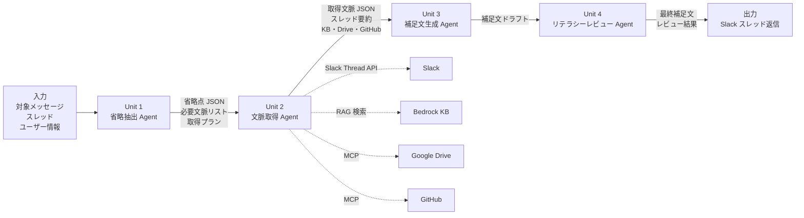

# 4 Unit / 4 Agent 詳細設計

**プロジェクト名**: 説明補足AI（Explain Bot）  
**バージョン**: 1.0.0  
**作成日**: 2026-05-10

---

## 概要

本アプリは AI-DLC の Unit 分解として、以下 4 つの専門 Agent で構成されます。各 Agent は Strands Orchestrator によって順次制御されます。

```
┌─────────────────────────────────────────────────────────────────────┐
│                      Strands Orchestrator                            │
│                                                                     │
│  ┌──────────┐    ┌──────────┐    ┌──────────┐    ┌──────────────┐  │
│  │  Unit 1  │    │  Unit 2  │    │  Unit 3  │    │   Unit 4     │  │
│  │ 省略抽出 │───▶│ 文脈取得 │───▶│ 補足文   │───▶│ リテラシー  │  │
│  │  Agent   │    │  Agent   │    │ 生成Agent│    │ レビューAgent│  │
│  └──────────┘    └──────────┘    └──────────┘    └──────────────┘  │
│                                                                     │
│  何が足りないか  必要な情報を    伝わる補足文を  品質・安全性を    │
│  を抽出する      収集・整理する  生成する        確認する          │
└─────────────────────────────────────────────────────────────────────┘
```

---

## Unit 1: 省略抽出 Agent

### 目的

対象 Slack 投稿を読み、何が省略されているか、何が暗黙知になっているか、聞き手がどこで詰まりそうかを抽出する。

**重要**: 回答文は生成しない。「足りない情報」の抽出に特化する。

### 入力

```json
{
  "target_message": "例の認証の件、来週から切り替える方向で。影響あるところだけ確認お願いします。",
  "poster_user_id": "U12345678",
  "channel_id": "C12345678",
  "channel_name": "proj-alpha-dev",
  "thread_ts": "1234567890.123456",
  "has_thread": true,
  "recent_messages": [
    {
      "user": "U87654321",
      "text": "先週の定例で認証方式の話が出てましたね",
      "ts": "1234567880.000000"
    }
  ]
}
```

### 出力

```json
{
  "message_intent": "認証方式の切り替えに関する共有・依頼",
  "omitted_points": [
    "「例の認証」が何を指すか明示されていない（独自認証？Cognito？）",
    "対象システム名が明示されていない",
    "なぜ切り替えが必要なのかの背景・理由が不足している",
    "いつ・誰が決定したのかが不明",
    "「影響あるところ」の具体的な範囲が不明",
    "確認すべき人が明示されていない",
    "確認後のアクション（Issue 追記？スレッド返信？）が不明"
  ],
  "implicit_knowledge": [
    "「例の認証」はチーム内で共有されている話題らしい",
    "来週という期限が設定されている"
  ],
  "required_context": [
    "直近スレッドの会話",
    "チャンネル履歴（認証に関する過去の議論）",
    "関連する GitHub Issue",
    "関連する議事録・仕様書"
  ],
  "risk": "このままでは聞き手が対象システム・切り替え理由・確認範囲・次アクションを追加質問する可能性が高い",
  "recommended_retrieval_plan": [
    "thread",
    "channel_summary",
    "github",
    "drive"
  ],
  "confidence": 0.9
}
```

### プロンプト方針

- 回答文を生成しない
- あくまで「足りない情報」を抽出する
- 発言者の意図を決めつけすぎない
- 不足情報を列挙する
- 追加で確認すべきデータソースを提案する
- 「事実」「推測」「不足」を分ける

### 成功条件

- 省略されている背景・前提・用語・次アクションを抽出できる
- 必要な文脈取得対象を過不足なく示せる
- 以降の Agent が利用しやすい構造化出力になっている

---

## Unit 2: 文脈取得 Agent

### 目的

省略抽出 Agent が示した必要文脈に基づき、補足文生成に必要な情報を収集・整理する。

**重要**: 毎回すべてを検索しない。Unit 1 の出力に基づき、必要な情報源のみ参照する。

### 取得優先順

```
1. 直近スレッド（Slack Thread API）
2. チャンネル履歴要約（S3 / DynamoDB）
3. Bedrock Knowledge Bases（社内ナレッジ）
4. MCP 経由の Google Drive / GitHub
```

### 入力

```json
{
  "omission_result": {
    "message_intent": "認証方式の切り替えに関する共有・依頼",
    "omitted_points": ["..."],
    "required_context": ["直近スレッド", "チャンネル履歴", "GitHub Issue", "議事録"],
    "recommended_retrieval_plan": ["thread", "channel_summary", "github", "drive"]
  },
  "target_message": "例の認証の件、来週から切り替える方向で。...",
  "slack_channel_id": "C12345678",
  "slack_thread_ts": "1234567890.123456",
  "slack_user_id": "U12345678",
  "channel_summary_key": "channel-summaries/C12345678/2026-05-10.json",
  "kb_search_query": "認証方式 切り替え Cognito",
  "github_search_query": "認証 切り替え issue",
  "drive_search_query": "認証方式 議事録 2026"
}
```

### 出力

```json
{
  "retrieved_context": {
    "thread_summary": "このスレッドでは、社内ポータルの認証方式をCognito連携に切り替える件について議論されている。先週の定例で方針が合意された。",
    "channel_summary": "このチャンネルはプロジェクトAlphaの開発連絡用。今週は認証方式の変更が主な話題。",
    "kb_context": [
      {
        "title": "認証基盤設計メモ",
        "summary": "独自認証からCognito連携への移行方針。まず開発環境で試験導入し、問題なければ本番適用。",
        "source": "knowledge_base",
        "relevance": 0.92
      }
    ],
    "github_context": [
      {
        "title": "Issue #123: 認証方式をCognitoに移行する",
        "summary": "セキュリティ運用負荷を下げるためCognito連携に移行する提案。影響範囲はログイン処理・ユーザー管理・権限チェック。",
        "source": "github",
        "url": "https://github.com/org/repo/issues/123"
      }
    ],
    "drive_context": [
      {
        "title": "2026-05-03 定例議事録",
        "summary": "認証基盤をAWS側に寄せる方針が合意。まず開発環境で試験導入。本番切り替えは別途判断。",
        "source": "google_drive"
      }
    ]
  },
  "confidence": 0.85,
  "missing_context": [
    "本番適用の具体的な日程は不明",
    "ロールバック手順は確認できなかった"
  ],
  "retrieval_sources_used": ["thread", "channel_summary", "github", "drive"]
}
```

### プロンプト方針

- Unit 1 の `recommended_retrieval_plan` に基づいて取得対象を決める
- 不要な検索を避ける
- 取得できた情報と取得できなかった情報を分ける
- 文脈ソースを明示する
- 後続 Agent が引用・要約できる粒度で整理する

### 成功条件

- 不要な検索を避けつつ、必要な根拠を集められる
- 文脈ソースを明示できる
- 取得できた情報と取得できなかった情報を分けられる
- 後続 Agent が引用・要約できる粒度で整理されている

### MVP での簡易化

最初の MVP では以下でも可：

- Slack 対象メッセージ
- 直近スレッド
- デモ用チャンネル要約（静的 JSON）
- デモ用 KB（数個の Markdown 資料）
- Drive / GitHub MCP はモックまたは最低限

---

## Unit 3: 補足文生成 Agent

### 目的

対象投稿に対する補足説明を、聞き手が追加質問しなくても理解できる形で生成する。

### 入力

```json
{
  "target_message": "例の認証の件、来週から切り替える方向で。影響あるところだけ確認お願いします。",
  "omission_result": {
    "message_intent": "認証方式の切り替えに関する共有・依頼",
    "omitted_points": ["..."]
  },
  "retrieved_context": {
    "thread_summary": "...",
    "channel_summary": "...",
    "kb_context": ["..."],
    "github_context": ["..."],
    "drive_context": ["..."],
    "missing_context": ["本番適用の具体的な日程は不明", "ロールバック手順は確認できなかった"]
  },
  "reader_profile": {
    "literacy_level": "standard",
    "role": "engineer",
    "audience_type": "project_member"
  },
  "tone": "slack_thread_reply"
}
```

### 出力

```
補足です。この投稿は、社内ポータルの認証方式を既存の独自認証から Cognito 連携に切り替える件についての共有です。

**背景**
先週の定例でセキュリティ運用負荷を下げるため、認証基盤を AWS 側に寄せる方針が合意されています（2026-05-03 定例議事録）。Issue #123 でも認証遅延と確認漏れが課題として挙がっています。

**対象範囲**
今回の変更対象はまず開発環境です。本番切り替えは別途判断予定です。利用者向け通知ではなく、ログイン処理・ユーザー管理・権限チェックに関わる内部実装が対象です。

**確認すべき人**
ログイン処理・ユーザー管理・権限チェックに関わる実装を持つ担当者です。

**次に取るべき行動**
影響範囲を確認し、懸念点があれば来週の切り替え前にこのスレッドへ返信してください。問題なければ Issue #123 に影響範囲を追記してください。

**不確かな点**
本番適用の具体的な日程とロールバック手順は、この投稿とスレッドだけでは明記されていません。
```

### 補足文の構成

| セクション | 内容 |
|-----------|------|
| 冒頭 | 「補足です。この投稿は〜についての共有/依頼/確認です。」 |
| 背景 | なぜこの話が出ているか。関連 Issue・議事録を引用 |
| 対象範囲 / 前提 | 何が対象で何が対象外か |
| 用語説明 | 略語・専門用語の説明（必要な場合） |
| 確認すべき人 | 誰が何をすべきか |
| 次に取るべき行動 | 具体的なアクション |
| 不確かな点 | この投稿だけでは不明な点 |

### プロンプト方針

- 発言者の意図を変えない
- 足りない背景を補える
- 読み手が次に取るべき行動を理解できる
- 推測と事実を混ぜない
- Slack に貼っても自然
- 長すぎず短すぎない（目安: 200〜400 文字）

### 成功条件

- 発言者の意図を変えない
- 足りない背景を補える
- 読み手が次に取るべき行動を理解できる
- 推測と事実を混ぜない
- Slack に貼っても自然
- 長すぎず短すぎない

---

## Unit 4: リテラシーレビュー Agent

### 目的

補足文が聞き手にとって適切か、説明過多・推測過多・誤解の恐れがないかを確認し、必要に応じて修正する。

### 入力

```json
{
  "draft_message": "補足です。この投稿は、社内ポータルの認証方式を...",
  "target_message": "例の認証の件、来週から切り替える方向で。...",
  "omission_result": {
    "message_intent": "認証方式の切り替えに関する共有・依頼",
    "omitted_points": ["..."]
  },
  "retrieved_context": {
    "missing_context": ["本番適用の具体的な日程は不明", "ロールバック手順は確認できなかった"]
  },
  "reader_profile": {
    "literacy_level": "standard",
    "role": "engineer",
    "audience_type": "project_member"
  }
}
```

### チェック項目

| チェック | 内容 |
|---------|------|
| 初見の人に伝わるか | 背景知識なしで理解できるか |
| 専門用語が多すぎないか | 想定読者に合った用語レベルか |
| 必要な用語説明があるか | 略語・専門用語に説明があるか |
| 発言者の意図を変えていないか | 元の投稿の意図を歪めていないか |
| 補足しすぎていないか | 不要な情報を追加していないか |
| 事実と推測が混ざっていないか | 根拠のない断定をしていないか |
| 根拠がない断定をしていないか | 「〜のはずです」などの断定がないか |
| Slack のスレッド返信として自然か | 文体・長さが適切か |
| 失礼な表現になっていないか | 投稿者・関係者に失礼でないか |
| 機密情報を過剰に出していないか | Drive / GitHub の機密情報を直接貼っていないか |
| 個人情報を含んでいないか | 氏名・メールアドレス等が含まれていないか |

### 出力

```json
{
  "approved": true,
  "final_message": "補足です。この投稿は、社内ポータルの認証方式を既存の独自認証から Cognito 連携に切り替える件についての共有です。\n\n**背景**\n先週の定例でセキュリティ運用負荷を下げるため、認証基盤を AWS 側に寄せる方針が合意されています（2026-05-03 定例議事録）。Issue #123 でも認証遅延と確認漏れが課題として挙がっています。\n\n**対象範囲**\n今回の変更対象はまず開発環境です。本番切り替えは別途判断予定です。\n\n**確認すべき人**\nログイン処理・ユーザー管理・権限チェックに関わる実装を持つ担当者です。\n\n**次に取るべき行動**\n影響範囲を確認し、懸念点があれば来週の切り替え前にこのスレッドへ返信してください。問題なければ Issue #123 に影響範囲を追記してください。\n\n**不確かな点**\n本番適用の具体的な日程とロールバック手順は、この投稿とスレッドだけでは明記されていません。",
  "review_comments": [
    "専門用語（Cognito）に説明を追加済み",
    "本番適用時期は不明なため不確かな点として明記",
    "ロールバック手順は確認できなかったため不確かな点として明記",
    "発言者の意図（切り替えの共有と影響確認の依頼）を維持"
  ],
  "risk_level": "low",
  "modifications_made": [
    "「Cognito」に「AWS の認証サービス」の説明を追加"
  ]
}
```

### プロンプト方針

- Slack に投稿して問題ない品質になっているか確認する
- 読み手のリテラシーに合っているか確認する
- 不明点は不明と書けているか確認する
- 文脈補足と過剰補足のバランスが取れているか確認する
- 問題があれば修正案を作る
- 最終的な Slack 投稿文を返す

### 成功条件

- Slack に投稿して問題ない品質になっている
- 読み手のリテラシーに合っている
- 不明点は不明と書けている
- 文脈補足と過剰補足のバランスが取れている

---

## Agent 間のデータフロー



---

## Unit 分解の設計判断

### なぜ 4 Unit に分けるのか

| 理由 | 説明 |
|------|------|
| 責務の分離 | 各 Agent が単一の責務を持つことで、品質向上・デバッグが容易 |
| 段階的処理 | 省略抽出 → 文脈取得 → 生成 → レビューの順序が論理的 |
| 文脈取得の最適化 | Unit 1 の出力に基づいて Unit 2 が必要な情報源のみ参照できる |
| 品質保証 | Unit 4 が独立してレビューすることで、生成品質を担保できる |
| AI-DLC の Unit 分解 | ハッカソンの評価基準「Unit 分解の適切さ」に直接対応 |

### なぜ 7 Agent にしないのか

初期案では 7 Agent 構成を検討しましたが、以下の理由で 4 Agent に絞りました：

- Agent 数が多いと Orchestrator の制御が複雑になる
- 各 Agent の責務が曖昧になりやすい
- MVP の実装コストが増える
- 4 Unit で十分な品質が出せる
