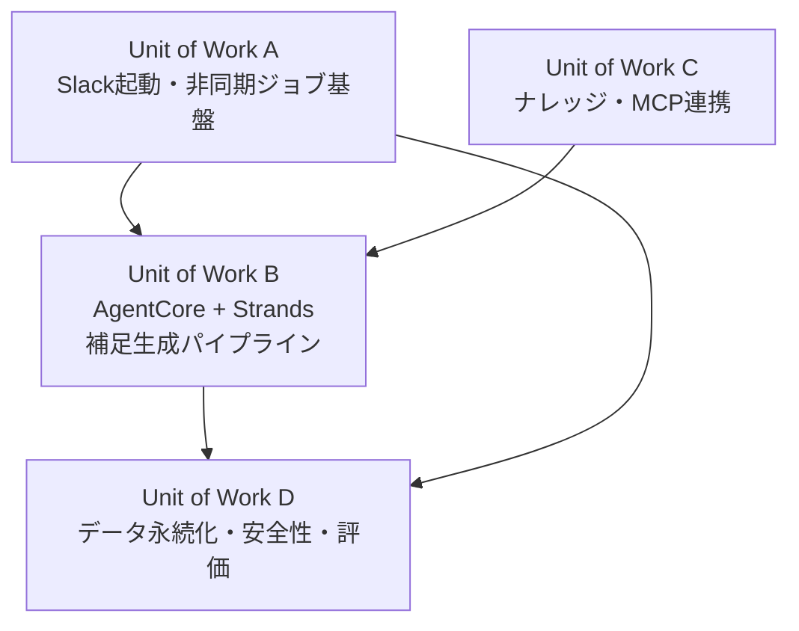
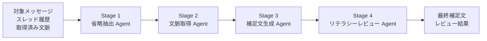

# AI-DLC Unit of Work 分解

**プロジェクト名**: 説明補足AI（Explain Bot）  
**バージョン**: 1.1.0

**作成日**: 2026-05-10

---

## 概要

AI-DLC における Unit of Work は、実行時の Agent そのものではなく、**並行開発可能な作業単位**です。Inception で Unit of Work に分解し、Construction では Unit of Work ごとに設計・実装・テストを進めます。

本プロジェクトでは、補足生成の内部処理を 4 つの Agent ステージに分けます。一方で、AI-DLC の Unit 分解は、MVP を作るための実装境界として以下の 4 つに整理します。

以下は `awslabs.aws-diagram-mcp-server` で生成した Unit of Work の概観図です。

---

## Unit of Work 一覧

| Unit of Work | 目的 | 並行開発しやすい理由 | 主な成果物 |
|--------------|------|----------------------|------------|
| A. Slack起動・非同期ジョブ基盤 | Message Shortcut から安全に job を受け付け、3秒以内に ack し、非同期処理へ渡す | Slack/API/Lambda/SQS の境界が明確で、AI処理と独立して開発できる | Slack App設定、API Gateway、Ack Lambda、SQS FIFO、Worker Lambda |
| B. AgentCore + Strands 補足生成パイプライン | 対象メッセージと文脈から補足文を生成し、レビューして返す | 入出力契約を固定すれば、Slack基盤やMCP連携と独立してプロンプト・Orchestratorを開発できる | AgentCore Runtime、Strands Orchestrator、4つのAgentステージ、プロンプト |
| C. ナレッジ・MCP連携 | KB、Google Drive、GitHub から補足に必要な根拠を取得する | 外部データ取得はインターフェース化でき、モックから本接続へ段階的に差し替えられる | Bedrock Knowledge Bases、AgentCore Gateway、Drive/GitHub MCP接続 |
| D. データ永続化・安全性・評価 | job履歴、権限制御方針、出力安全性、評価指標を整える | DynamoDB/S3/Guardrails/評価データは他Unitの入出力を受けて検証できる | DynamoDB設計、S3設計、Guardrails方針、テストデータ評価表 |

---

## Unit A: Slack起動・非同期ジョブ基盤

### スコープ

- Slack Message Shortcut の起動
- Slack Interactivity Request の受信
- Slack署名検証
- 3秒以内の ack
- job_id 発行
- DynamoDB への job 登録
- SQS FIFO への投入
- Worker Lambda による Slack API 呼び出し
- 元投稿スレッドへの返信

### 受け入れ条件

- Message Shortcut から対象メッセージを特定できる
- Slackの3秒制約内に 200 OK を返せる
- 同一リクエストの重複実行を抑制できる
- Worker が対象メッセージとスレッド履歴を取得できる
- Worker が最終補足文を元投稿スレッドへ投稿できる

### 依存関係

- Unit B の最終補足文出力を受け取る
- Unit D の `explain_jobs` テーブルへ job 状態を保存する

---

## Unit B: AgentCore + Strands 補足生成パイプライン

### スコープ

- AgentCore Runtime 上での Strands Orchestrator 実行
- 省略抽出 Agent
- 文脈取得 Agent
- 補足文生成 Agent
- リテラシーレビュー Agent
- 各ステージの入出力JSON定義
- Bedrock モデル選定
- プロンプト設計

### 実行時 Agent ステージ

### 受け入れ条件

- 省略点、必要文脈、補足文、レビュー結果を構造化して受け渡せる
- 事実と推測を分離できる
- 不明点を不明として表現できる
- Slackに投稿して自然な長さ・文体に整えられる
- AgentCore Runtime の利用を第一候補にし、詰まった場合も同じ入出力契約で Bedrock 直接呼び出しへ退避できる

### 依存関係

- Unit A から対象メッセージとスレッド履歴を受け取る
- Unit C から取得文脈を受け取る
- Unit D の評価観点で出力品質を検証する

---

## Unit C: ナレッジ・MCP連携

### スコープ

- Bedrock Knowledge Bases による社内ナレッジ検索
- S3 上のKBソース管理
- チャンネル履歴要約の参照
- AgentCore Gateway 経由の Google Drive MCP
- AgentCore Gateway 経由の GitHub MCP
- Slack文脈取得は MCP ではなく Slack Web API を直接利用する方針の明文化

### 受け入れ条件

- 文脈取得 Agent から検索要求を受け、必要な情報源のみ参照できる
- KB、Drive、GitHub の取得結果を source 付きで返せる
- 取得できた情報と取得できなかった情報を分離できる
- Privateチャンネルに参加している権限者向けのデモに限定し、権限のない情報をSlackに貼らない

### 依存関係

- Unit B の文脈取得 Agent から呼び出される
- Unit D の権限制御・安全性方針に従う

---

## Unit D: データ永続化・安全性・評価

### スコープ

- `explain_jobs` の job 状態管理
- `user_profiles` と `channel_contexts` の設計
- TTL による保存期間制御
- Slack Privateチャンネルを前提にした権限制御方針
- Guardrails とレビューAgentによる安全性確認
- テストデータに対する想定補足ポイント充足率の評価
- 定性評価の収集観点

### 受け入れ条件

- job の状態遷移を追跡できる
- Slack本文や取得文脈を長期保存しすぎない
- 機密情報・個人情報を過剰に出力しない
- 事前に用意したテストデータごとに、想定補足ポイントの充足率を集計できる
- 審査員やデモ参加者が「説明不足な投稿の意味を理解しやすくなった」と評価できる

### 評価指標

| 種別 | 指標 | 目標 |
|------|------|------|
| 定性 | 審査員・デモ参加者が補足文を読んで投稿意図を理解できる | 肯定的評価を得る |
| 定性 | 「雑な投稿でも伝わってしまう」というテーマ性が伝わる | プレゼンで説明できる |
| 定量 | 想定補足ポイント充足率 | 80%以上 |
| 定量 | 補足生成完了時間 | 30秒以内を目標 |
| 定量 | job 処理成功率 | 95%以上を目標 |

---

## AgentステージとUnit of Workの関係

| Agentステージ | 所属する Unit of Work | 説明 |
|---------------|------------------------|------|
| 省略抽出 Agent | Unit B | 対象投稿から説明不足・暗黙知・必要文脈を抽出する |
| 文脈取得 Agent | Unit B / Unit C | 取得方針は Unit B、実際の外部検索は Unit C の機能を利用する |
| 補足文生成 Agent | Unit B | 背景・前提・次アクションを整理した補足文を生成する |
| リテラシーレビュー Agent | Unit B / Unit D | レビュー処理は Unit B、安全性・評価観点は Unit D と連携する |

---

## 設計判断

### なぜ Agent と Unit を分けて記述するのか

AI-DLC の評価で見られる Unit 分解は、実装・設計・テストを並行して進められる作業単位です。一方、Agent はアプリケーション実行時の内部処理単位です。両者を同じものとして書くと、AI-DLC の理解が浅く見えるリスクがあります。

そのため、本リポジトリでは以下の用語で統一します。

- **Unit of Work**: AI-DLC の作業単位
- **Agentステージ**: Strands Orchestrator 内で実行される AI 処理単位

### なぜ Unit of Work を4つにしたのか

- Slack基盤、AI処理、外部文脈取得、データ・安全性・評価を別担当で並行開発できる
- 各Unitの成果物と受け入れ条件が明確
- MVP段階ではモックを使って依存を切り、段階的に本接続へ移行できる
- ハッカソンの書類審査で、Intent だけでなく実装計画の現実性も伝えられる
