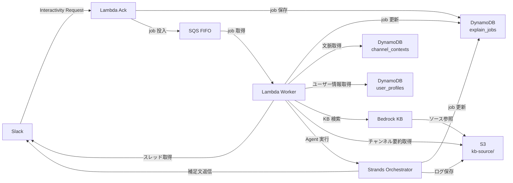

# データ設計

**プロジェクト名**: 説明補足AI（Explain Bot）  
**バージョン**: 1.0.0  
**作成日**: 2026-05-10

---

## 1. DynamoDB テーブル設計

### 1.1 explain_jobs テーブル

**用途**: 補足生成ジョブの状態管理

#### キー設計

| キー | 属性名 | 型 | 説明 |
|------|--------|-----|------|
| PK | `job_id` | String | UUID v4 |
| GSI1 PK | `slack_channel_id` | String | チャンネル別クエリ用 |
| GSI1 SK | `created_at` | String | ISO 8601 形式 |
| GSI2 PK | `slack_user_id` | String | ユーザー別クエリ用 |
| GSI2 SK | `created_at` | String | ISO 8601 形式 |

#### 属性一覧

| 属性名 | 型 | 必須 | 説明 |
|--------|-----|------|------|
| `job_id` | String | ✅ | UUID v4 |
| `slack_team_id` | String | ✅ | Slack ワークスペース ID |
| `slack_channel_id` | String | ✅ | チャンネル ID |
| `slack_message_ts` | String | ✅ | 対象メッセージのタイムスタンプ |
| `slack_thread_ts` | String | ✅ | スレッドのタイムスタンプ |
| `requested_by_user_id` | String | ✅ | 補足を依頼したユーザー ID |
| `target_user_id` | String | - | 対象メッセージの投稿者 ID |
| `target_message_text` | String | ✅ | 対象メッセージのテキスト |
| `status` | String | ✅ | ジョブの状態（下記参照） |
| `request_payload` | Map | - | Slack Interactivity の payload |
| `reader_profile` | Map | - | 読み手のリテラシー設定 |
| `omission_result` | Map | - | 省略抽出 Agent の出力 |
| `retrieved_context` | Map | - | 文脈取得 Agent の出力 |
| `draft_message` | String | - | 補足文生成 Agent の出力（補足文ドラフト） |
| `final_message` | String | - | リテラシーレビュー Agent の出力（最終補足文） |
| `review_result` | Map | - | リテラシーレビュー Agent のレビュー結果 |
| `error_message` | String | - | エラーメッセージ |
| `created_at` | String | ✅ | ISO 8601 形式 |
| `updated_at` | String | ✅ | ISO 8601 形式 |
| `ttl` | Number | ✅ | TTL 用 Unix タイムスタンプ（30 日後） |

#### status の値

| 値 | 説明 |
|----|------|
| `RECEIVED` | Slack からリクエストを受信した |
| `CONTEXT_FETCHING` | 文脈取得中 |
| `GENERATING` | 補足文生成中 |
| `REVIEWING` | リテラシーレビュー中 |
| `POSTED` | Slack に返信済み |
| `FAILED` | 処理失敗 |

#### サンプルアイテム

```json
{
  "job_id": "550e8400-e29b-41d4-a716-446655440000",
  "slack_team_id": "T12345678",
  "slack_channel_id": "C12345678",
  "slack_message_ts": "1234567890.123456",
  "slack_thread_ts": "1234567890.123456",
  "requested_by_user_id": "U87654321",
  "target_user_id": "U12345678",
  "target_message_text": "例の認証の件、来週から切り替える方向で。影響あるところだけ確認お願いします。",
  "status": "POSTED",
  "reader_profile": {
    "literacy_level": "standard",
    "audience_type": "engineer"
  },
  "omission_result": {
    "message_intent": "認証方式の切り替えに関する共有・依頼",
    "omitted_points": [
      "「例の認証」が何を指すか明示されていない",
      "対象システム名が明示されていない"
    ],
    "recommended_retrieval_plan": ["thread", "channel_summary", "github"]
  },
  "final_message": "補足です。この投稿は、社内ポータルの認証方式を...",
  "created_at": "2026-05-10T10:00:00+09:00",
  "updated_at": "2026-05-10T10:00:35+09:00",
  "ttl": 1749513600
}
```

#### TTL 設定

- TTL: 30 日後（デモ用は 7 日でも可）
- Slack 本文や取得文脈は長期保存しない

---

### 1.2 user_profiles テーブル

**用途**: ユーザーのリテラシー・役割・説明スタイルを管理

#### キー設計

| キー | 属性名 | 型 | 説明 |
|------|--------|-----|------|
| PK | `slack_user_id` | String | Slack ユーザー ID |

#### 属性一覧

| 属性名 | 型 | 必須 | 説明 |
|--------|-----|------|------|
| `slack_user_id` | String | ✅ | Slack ユーザー ID |
| `display_name` | String | - | 表示名 |
| `role` | String | - | 役割（engineer / non_engineer / manager など） |
| `years_of_experience` | Number | - | 経験年数 |
| `expertise_tags` | List | - | 専門分野タグ（["AWS", "Python", "認証"] など） |
| `preferred_explanation_level` | String | - | 好みの説明レベル（simple / standard / detailed） |
| `default_audience_type` | String | - | デフォルトの想定読者タイプ |
| `created_at` | String | ✅ | ISO 8601 形式 |
| `updated_at` | String | ✅ | ISO 8601 形式 |

#### サンプルアイテム

```json
{
  "slack_user_id": "U87654321",
  "display_name": "田中 太郎",
  "role": "engineer",
  "years_of_experience": 3,
  "expertise_tags": ["AWS", "Python", "バックエンド"],
  "preferred_explanation_level": "standard",
  "default_audience_type": "engineer",
  "created_at": "2026-05-01T09:00:00+09:00",
  "updated_at": "2026-05-10T10:00:00+09:00"
}
```

**MVP での簡易化**: 静的な JSON ファイルや DynamoDB への手動入力でも可。

---

### 1.3 channel_contexts テーブル

**用途**: チャンネルごとの文脈・要約・関連 KB を管理

#### キー設計

| キー | 属性名 | 型 | 説明 |
|------|--------|-----|------|
| PK | `slack_channel_id` | String | チャンネル ID |
| SK | `context_version` | String | `SUMMARY#YYYYMMDD` または `LATEST` |

#### 属性一覧

| 属性名 | 型 | 必須 | 説明 |
|--------|-----|------|------|
| `slack_channel_id` | String | ✅ | チャンネル ID |
| `context_version` | String | ✅ | バージョン（`SUMMARY#20260510` など） |
| `channel_name` | String | - | チャンネル名 |
| `project_name` | String | - | 関連プロジェクト名 |
| `summary` | String | - | チャンネルの概要・最近の話題 |
| `glossary` | Map | - | チャンネル固有の用語集 |
| `related_kb_id` | String | - | 関連する Knowledge Base の ID |
| `related_drive_folder_ids` | List | - | 関連する Drive フォルダ ID |
| `related_github_repositories` | List | - | 関連する GitHub リポジトリ |
| `updated_at` | String | ✅ | ISO 8601 形式 |

#### サンプルアイテム

```json
{
  "slack_channel_id": "C12345678",
  "context_version": "SUMMARY#20260510",
  "channel_name": "proj-alpha-dev",
  "project_name": "プロジェクト Alpha",
  "summary": "プロジェクト Alpha の開発連絡チャンネル。今週は認証方式の変更が主な話題。来週から開発環境で Cognito 連携を試験導入予定。",
  "glossary": {
    "Cognito": "AWS の認証サービス。ユーザー管理・認証・認可を提供する。",
    "独自認証": "現在使用している社内開発の認証システム。",
    "Issue #123": "認証方式を Cognito に移行する GitHub Issue。"
  },
  "related_kb_id": "kb-alpha-project",
  "related_drive_folder_ids": ["1BxiMVs0XRA5nFMdKvBdBZjgmUUqptlbs"],
  "related_github_repositories": ["org/proj-alpha"],
  "updated_at": "2026-05-10T09:00:00+09:00"
}
```

---

### 1.4 feedback テーブル

**用途**: 生成結果へのユーザーフィードバック

#### キー設計

| キー | 属性名 | 型 | 説明 |
|------|--------|-----|------|
| PK | `job_id` | String | job ID |
| SK | `feedback_id` | String | UUID v4 |

#### 属性一覧

| 属性名 | 型 | 必須 | 説明 |
|--------|-----|------|------|
| `job_id` | String | ✅ | 対象 job の ID |
| `feedback_id` | String | ✅ | UUID v4 |
| `feedback_type` | String | ✅ | フィードバックの種類（下記参照） |
| `comment` | String | - | 自由記述コメント |
| `user_id` | String | ✅ | フィードバックしたユーザー ID |
| `created_at` | String | ✅ | ISO 8601 形式 |

#### feedback_type の値

| 値 | 説明 |
|----|------|
| `useful` | 役に立った |
| `too_long` | 長すぎる |
| `incorrect` | 内容が違う |
| `too_hard` | 難しすぎる |
| `too_short` | 短すぎる |
| `other` | その他 |

---

## 2. S3 バケット設計

### バケット構成

```
explain-bot-{account-id}-{region}/
├── kb-source/                    # Knowledge Bases のソースドキュメント
│   ├── project-overview.md       # プロジェクト概要
│   ├── glossary.md               # 用語集
│   ├── system-architecture.md    # システム構成メモ
│   ├── requirements.md           # 要件定義メモ
│   └── decisions/                # 過去の意思決定メモ
│       └── 2026-05-03-auth.md
├── channel-summaries/            # チャンネル履歴要約
│   └── {channel_id}/
│       └── 2026-05-10.json
├── logs/                         # 実行ログ
│   └── {year}/{month}/{day}/
│       └── {job_id}.json
```

### S3 バケットポリシー

- パブリックアクセスをすべてブロック
- Lambda の IAM ロールからのみアクセスを許可
- サーバーサイド暗号化（SSE-S3 または SSE-KMS）を有効化

---

## 3. API 設計

### POST /slack/interactivity

Slack の Interactivity Request を受け取るエンドポイント。

#### リクエスト

```
POST /slack/interactivity
Content-Type: application/x-www-form-urlencoded
X-Slack-Signature: v0=...
X-Slack-Request-Timestamp: 1234567890
```

```
payload=%7B%22type%22%3A%22message_action%22%2C...%7D
```

#### payload の構造（Message Shortcut）

```json
{
  "type": "message_action",
  "callback_id": "explain_message",
  "trigger_id": "...",
  "message_ts": "1234567890.123456",
  "message": {
    "type": "message",
    "text": "例の認証の件、来週から切り替える方向で。...",
    "user": "U12345678",
    "ts": "1234567890.123456",
    "thread_ts": "1234567890.123456"
  },
  "channel": {
    "id": "C12345678",
    "name": "proj-alpha-dev"
  },
  "user": {
    "id": "U87654321",
    "name": "tanaka.taro"
  },
  "team": {
    "id": "T12345678",
    "domain": "example"
  }
}
```

#### レスポンス（3 秒以内）

```
HTTP/1.1 200 OK
Content-Type: application/json

{}
```

または（モーダルを表示する場合）：

```json
{
  "response_action": "push",
  "view": {
    "type": "modal",
    "callback_id": "explain_options",
    "title": {
      "type": "plain_text",
      "text": "説明補足AI"
    },
    "blocks": []
  }
}
```

### Worker Lambda（内部処理）

外部 API として公開しない。SQS トリガーで実行。

#### SQS メッセージ形式

```json
{
  "job_id": "550e8400-e29b-41d4-a716-446655440000",
  "slack_team_id": "T12345678",
  "slack_channel_id": "C12345678",
  "slack_message_ts": "1234567890.123456",
  "slack_thread_ts": "1234567890.123456",
  "requested_by_user_id": "U87654321",
  "target_user_id": "U12345678",
  "target_message_text": "例の認証の件、来週から切り替える方向で。...",
  "reader_profile": {
    "literacy_level": "standard",
    "audience_type": "engineer"
  }
}
```

---

## 4. データフロー


